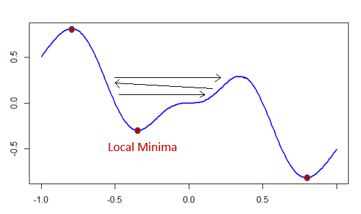
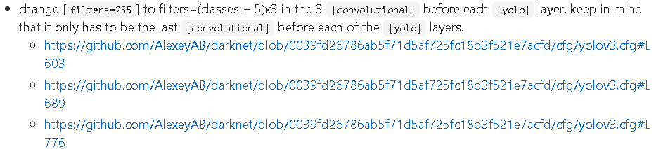

## [Read this in English](#INTRODUCTION)

# GIỚI THIỆU

Autochess Probabilities and Line-up Tracker là phần mềm hỗ trợ người chơi Dota2-Autochess - một game chiến thuật thời gian thực lấy cảm hứng từ Dota2 và Cờ vua, Mạt chược, và Búa Lá Kéo.
Phần mềm sử dụng OpenCV, CNN Darket-Yolov4 để nhận diện hình ảnh và PyQt5 để làm giao diện người dùng.

Phần README này được sử dụng để mô tả lại quá trình xây dựng phần mềm này.


# I.TẠO MÔ HÌNH NHẬN DIỆN HÌNH ẢNH

## 1/Thu thập dữ liệu

Tất cả mọi nhân vật (quân cờ) trong Autochess đều có mặt trong bức hình dưới đây (83 nhân vật). Tuy nhiên hầu hết các nhân vật trong Autochess đều có 3 cấp độ tương ứng với 3 trang phục khác nhau nên số lượng hình ảnh cần thu thập thực chất lớn gấp 3.


 
Việc chúng ta muốn làm bây giờ là click vào từng nhân vật để xem chúng dưới góc nhìn 3D, chụp ảnh chúng từ nhiều góc camera khác nhau và lưu vào các thư mục riêng biệt.

Nhiệm vụ này có tính lặp đi lặp lại khá cao nên có thể thực hiện bằng cách xác định các tọa độ chuột cần click và sử dụng các thư viện mô phỏng thao tác bàn phím và chuột như PyAutoGUI.

Các vị trí cần click:


 
### *Code được sử dụng để làm điều này:*

```python

import pyautogui
import time
import math
import os

# load constants
first_characters_coordinate = (124, 100)
distance_between_columns = 80
distance_between_rows = 130
shows_3D_model_coordinate = (1400, 260)
camera_positions = ((40, 916), (46, 916), (52, 916), (55, 916), (58, 916), (63, 916), (66, 916), (70, 916))
image_region = (527, 619, 848, 212)
all_characters = ('Abaddon', 'Alchemist', 'Axe', 'BeastMaster', 'Panda', 'Chaos', 'Nyx', 'Mirana', 'Razor', 'Morphling','Clock','Doom','Barathum', 'Batrider', 'BH', 'Brood', 'Chen', 'CM', 'DarkWillow', 'Dazzle', 'Disruptor', 'DragonKnight', 'Drow','EarthShaker', 'EarthSpirit', 'Elder', 'EmberSpirit', 'Enchantress', 'Enigma', 'Grandma', 'Grim', 'Gyro', 'Huskar','IceDuck', 'Invoker', 'IO', 'Jakiro', 'Juggernaut', 'KOTL', 'Kunkka', 'LC', 'LoneDruid', 'Leshrac', 'Lich', 'Lina','Lion', 'Luna', 'Lycan', 'Mars', 'Medusa', 'Meepo', 'MonkeyKing', 'AM', 'Necrophos', 'Nevermore', 'NP', 'OgreMagi','OmniKnight', 'Oracle', 'PhuongAnh', 'Pudge', 'QOP', 'SandKing', 'SD', 'ShadowShaman', 'Sladar', 'Slark','Sniper', 'Storm', 'Sven', 'TB', 'Tide', 'Timber', 'Tiny', 'TramAnh', 'Treant', 'Troll', 'Tuskar', 'Undying','Ursa', 'Venom', 'Viper', 'Visage', 'Void', 'VoidSpirit', 'WindRanger', 'Zeus', 'Tinker', 'WitchDoctor','Terrorist', 'Rubik')


# creates separate folders for each character
for character in all_characters:
    try:
        os.mkdir("G:/all_characters/" + character)
    except OSError as error:
        pass


# iterates through all characters
for i in range(len(all_characters)):

    # identify which row we are currently at (each row has 17 characters)
    row = math.floor(i/17)

    # calculates character's coordinate
    coordinate = first_characters_coordinate[0] + i * distance_between_columns, \
                 first_characters_coordinate[1] + distance_between_rows * row

    # mouse clicks to select character
    pyautogui.click(coordinate)
    time.sleep(0.5)

    # mouse clicks to select "shows character's 3D model"
    pyautogui.click(shows_3D_model_coordinate)
    time.sleep(3)

    # iterates through all camera positions, we want to take 20 pictures for each position
    for j in range(len(camera_positions)*20):

        # selects camera position and takes a picture
        pyautogui.click(camera_positions[math.floor(j/20)])
        img = pyautogui.screenshot(region=image_region)

        # changes directory to the current character folder and saves screenshot
        os.chdir("G:/all_characters/" + all_characters[i])
        img.save(all_characters[i] + "_pos_" + str(math.floor(j/20) + 1) + "_" str(f"{j%20:02d}") + ".png")
	
```

Kết quả sau khi để script tự chạy trong 30’
 


Mặc trang phục cấp 2 và cấp 3 cho nhân vật và lặp lại script trên ta được:
 


## 2/Loại bỏ background và dán nhãn hàng loạt nhân vật đơn lẻ

### A/Loại bỏ background:


Bước đầu tiên cần thực hiện là vẽ mặt nạ (mask) cho nhân vật và loại bỏ hình nền (background). Có nhiều thuật toán khác nhau có thể sử dụng nhưng phù hợp nhất có lẽ là OpenCV BackgroundSubtractor (https://docs.opencv.org/3.4/d7/df6/classcv_1_1BackgroundSubtractor.html) vì chúng ta có sẵn hình nền bao gồm nhân vật và hình nền không bao gồm nhân vật (negative sample).


khởi tạo mô hình:

```python
backgroundSubtractor = cv2.createBackgroundSubtractorKNN(history=1, dist2Threshold=1200)
```
- *history là tổng số khung hình (frame) trước đó mà được tính là có ảnh hưởng/được mang ra so sánh với khung hình hiện tại, ở đây chúng ta chỉ cần 1 khung hình trước đó.*

- *dist2Threshold là bình phương khoảng cách (mức độ khác biệt) khi so sánh các pixels của 2 bức ảnh với nhau. Nếu con số này được thiết lập quá thấp thì kết quả sẽ có rất nhiều nhiễu (noises), còn nếu được thiết lập quá cao thì nhân vật sẽ bị mất các chi tiết.*

Có 3 thứ chúng ta có thể làm để tối thiểu noises, thứ nhất là bôi đen toàn bộ bức ảnh chỉ trừ một khoảng xung quanh nhân vật. Để làm được vậy ta cần xác định được các vị trí mà nhân vật sẽ đứng cũng như chiều dài và chiều rộng của nhân vật

Thứ 2 là sử dụng Gaussian Blur (làm mờ phân phối chuẩn) để “dung hòa” 2 bức ảnh, những sự khác biệt quá nhỏ giữa 2 bức ảnh sẽ trở nên giống nhau hơn

```python
background_image = cv2.GaussianBlur(background_image, (5, 5), 0)
```

Thứ 3 là sử dụng các thuật toán giảmnhiễu sau khi đã loại bỏ background:

- *thuật toán hình thái học: Opening Morphology giúp loại bỏ các nhiễu nhỏ đứng một mình xung quanh nhân vật*
- *thuật toán hình thái học Closing Morphology giúp lấp đầy các chi tiết bị mất của nhân vật*
- *thuật toán giảm nhiễu không sử dụng giá trị trung bình của các điểm ảnh địa phương (Non-Local Means Denoising)*

```python
kernel = np.ones((3, 3), np.uint8)
foregroundmask = cv2.morphologyEx(foregroundmask, cv2.MORPH_OPEN, kernel)
foregroundmask = cv2.morphologyEx(foregroundmask, cv2.MORPH_CLOSE, kernel)
foregroundmask = cv2.fastNlMeansDenoising(foregroundmask, None, 30, 7, 21)
```

Áp dụng mô hình:

```python
backgroundSubtractor.apply(background_image, learningRate=0.99)
backgroundSubtractor.apply(background_image, learningRate=0.99)
backgroundSubtractor.apply(background_image, learningRate=0.99)
backgroundSubtractor.apply(background_image, learningRate=0.99)
foregroundmask = backgroundSubtractor.apply(character_image, learningRate=0)
```

- *learningRate là tốc độ mô hình “học” – khi đối số này bằng 0 thì mô hình sẽ hoàn toàn không cập nhật, khi đối số này bằng 1 thì background đã được học trước đó sẽ bị loại bỏ và mô hình sẽ được khởi tạo lại bắt đầu từ khung hình hiện tại. Ta cần mô hình học nhanh nhất có thể nên learningRate sẽ để ở mức 0.99. Ngoài ra mô hình cũng cần ít nhất 4 khung hình để “học”*

- *Ta áp dụng learningRate = 0 cho bức hình có nhân vật vì ta không muốn mô hình nghĩ bức hình đó là background. Giá trị trả về là mặt nạ của nhân vật.*

Kết quả sau khi áp dụng bitwise_and giữa mặt nạ và hình ảnh ban đầu:

```python
background_removed_image = cv2.bitwise_and(character_image, character_image, mask=foregroundmask)
```


### B/Tìm đường viền:


Với thuật toán FindContour của OpenCV: (https://docs.opencv.org/3.4/d3/dc0/group__imgproc__shape.html#ga17ed9f5d79ae97bd4c7cf18403e1689a) 
ta có thể tìm đường viền cho tất cả các vật thể trong hình ảnh. Do đã loại bỏ background, ta có thể dễ dàng xác định nhân vật của chúng ta bằng cách tìm đường viền có diện tích lớn nhất.

```python
contours, hierarchy = cv2.findContours(foregroundmask, cv2.RETR_TREE, cv2.CHAIN_APPROX_NONE)
```

- *Bắt buộc phải sử dụng mặt nạ foregroundmask vì findContours chỉ có thể tìm đường viền quanh những vật thể trắng trên nền đen (RGB = 255).*

- *Tham số cv2.RETR_TREE thiết lập phương thức trả về đường viền, ở đây, OpenCV sẽ truy xuất tất cả các đường viền trả về một hệ thống phân cấp đầy đủ của các đường viền được lồng vào nhau.*

- *Tham số cv2.CHAIN_APPROX_NONE thiết lập thuật toán xác định đường viền, ở đây, OpenCV sẽ tìm tất cả các điểm trên đường viền.*

Sử dụng hàm cv2.contourArea ta có thể tìm diện tích của các đường viền:

```python
areas = [cv2.contourArea(c) for c in contours]
```

Sắp xếp theo thứ tự lớn đến bé và sử dụng hàm cv2.boundingRect ta được giá trị trả về là tọa độ trên cùng góc trái của đường viền lớn nhất cùng với chiều rộng và chiều dài:

```python
temp_areas = sorted(areas, reverse = True)
x, y, w, h = cv2.boundingRect(contours[areas.index(temp_areas[0])])
```
 
### C/Dán nhãn:


Nhãn trong mô hình YOLO có công thức như sau:


 
Do vậy, công thức chuyển đổi từ các giá trị của OpenCV sang YOLO sẽ như sau:
x_yolo = (x + w)/2/IMAGE_WIDTH
y_yolo = (y + h)/2/IMAGE_HEIGHT
width_yolo = w /IMAGE_WIDTH
height_yolo = h /IMAGE_HEIGHT

Tên của nhãn sẽ chính là tên của folder chứa nhân vật.

### *Code được sử dụng để thực hiện điều này:*

```python
import cv2
import os
import numpy as np


"""
Loads constants to ram
"""

# Images shape
IMAGE_WIDTH = 848
IMAGE_HEIGHT = 212


# 8 positions where characters stand, we will blacken all other parts of the images to remove noises
POS_LIST = [(105, 140), (105, 202), (105, 294), (105, 388), (105, 480), (105, 542), (105, 634), (105, 726)]


# Mapping characters names to their numbers
f = open('heroes_names.txt', "r").read().splitlines()
dict = {}
count = 0
for hero in f:
    dict[hero] = count
    count += 1


"""
Defines remove-background function. Some parameters have default values and can be used for most cases. However,  
there are abnormalities that require tweaking (characters that are too big, characters whose colors are similar to the
background's they stand on)
"""
def remove_background(background_image_path, character_image_path, hero_height=170, hero_width=150, threshold=1200):
    # Reads images
    background_image = cv2.imread(background_image_path)
    character_image = cv2.imread(character_image_path)

    # Creates a model
    backgroundSubtractor = cv2.createBackgroundSubtractorKNN(history=1, dist2Threshold=threshold)

    # Gaussian blurs images to "harmonize" them
    background_image = cv2.GaussianBlur(background_image, (5, 5), 0)
    character_image = cv2.GaussianBlur(character_image, (5, 5), 0)

    # Lets the model "learn" the background, it needs at least 4 frames
    backgroundSubtractor.apply(background_image, learningRate=0.99)
    backgroundSubtractor.apply(background_image, learningRate=0.99)
    backgroundSubtractor.apply(background_image, learningRate=0.99)
    backgroundSubtractor.apply(background_image, learningRate=0.99)

    # Model identifies the differences, i.e., the character, from background and return a mask
    foregroundmask = backgroundSubtractor.apply(character_image, learningRate=0)

    # Creates a kernel
    kernel = np.ones((3, 3), np.uint8)

    # Applies various denoising methods to the mask
    foregroundmask = cv2.morphologyEx(foregroundmask, cv2.MORPH_OPEN, kernel)
    foregroundmask = cv2.morphologyEx(foregroundmask, cv2.MORPH_CLOSE, kernel)
    foregroundmask = cv2.fastNlMeansDenoising(foregroundmask, None, 30, 7, 21)

    # Removes dispersed, low-value noises and cranks up character's pixels' values
    ret, foregroundmask = cv2.threshold(foregroundmask, 50, 255, cv2.THRESH_BINARY)

    # Gets character's position coordinate
    position = int(character_image_path[-8])
    position_coordinate = POS_LIST[position-1]

    # Calculates a rectangle where character stands and the rest of the image will be set to 0
    # In case character is too big then the rectangle's height is set to be the same as the image's height
    if position_coordinate[0] > hero_height / 2:
        to_be_removed_ara_height_1 = int(position_coordinate[0] - hero_height / 2)
    else:
        to_be_removed_ara_height_1 = 0

    if (position_coordinate[0] + hero_height / 2) < IMAGE_HEIGHT:
        to_be_removed_ara_height_2 = int(position_coordinate[0] + hero_height / 2)
    else:
        to_be_removed_ara_height_2 = IMAGE_HEIGHT

    if position_coordinate[1] > hero_width / 2:
        to_be_removed_ara_width_1 = int(position_coordinate[1] - hero_width / 2)
    else:
        to_be_removed_ara_width_1 = 0

    if (position_coordinate[1] + hero_width / 2) < IMAGE_WIDTH:
        to_be_removed_ara_width_2 = int(position_coordinate[1] + hero_width / 2)
    else:
        to_be_removed_ara_width_2 = IMAGE_WIDTH

    # Sets irrelevant parts of the image to 0
    foregroundmask[0: to_be_removed_ara_height_1, 0:IMAGE_WIDTH] = 0
    foregroundmask[to_be_removed_ara_height_2: IMAGE_HEIGHT, 0:IMAGE_WIDTH] = 0
    foregroundmask[0: IMAGE_HEIGHT, 0: to_be_removed_ara_width_1] = 0
    foregroundmask[0: IMAGE_HEIGHT, to_be_removed_ara_width_2: IMAGE_WIDTH] = 0

    # Applies bitwise_and to the original image.
    background_removed_image = cv2.bitwise_and(character_image, character_image, mask=foregroundmask)

    # Returns mask and background-removed image
    return foregroundmask, background_removed_image


"""
Defines function to get the biggest contour from mask
"""
def get_image_contour_box(foregroundmask):
    # Retrieves contours
    contours, hierarchy = cv2.findContours(foregroundmask, cv2.RETR_TREE, cv2.CHAIN_APPROX_NONE)

    # Gets a list of contours' sizes
    areas = [cv2.contourArea(c) for c in contours]

    # Sorts and gets the index the biggest contour, also, gets the bounding rectangle of it.
    temp_areas = areas
    temp_areas = sorted(temp_areas, reverse=True)
    x, y, w, h = cv2.boundingRect(contours[areas.index(temp_areas[0])])

    # Return coordinate, width, height of bounding box
    return x, y, w, h


"""
Defines function to create a txt file that stores character's number and bounding box
"""
def create_label_and_draw_bounding_box(character_image_path, character_number, x, y, w, h):
    # Changes coordinate, width, height to YOLO format
    x_yolo = (x + w) / 2 / IMAGE_WIDTH
    y_yolo = (y + h) / 2 / IMAGE_HEIGHT
    width_yolo = w / IMAGE_WIDTH
    height_yolo = h / IMAGE_HEIGHT

    # Writes txt file
    with open(character_image_path[0:-4] + ".txt", "w+") as f:
        f.write(f"{character_number} {x_yolo} {y_yolo} {width_yolo} {height_yolo}")


"""
Defines main
"""
def main():
    # Defines paths
    all_characters_path = 'G:/all_characters/'
    all_background_path = 'G:/background/'
    all_background_removed_characters_path = 'G:/all_background_removed_characters/'

    # Lists all characters' folders
    all_characters = os.listdir(all_characters_path)

    # Iterates through all folder
    for character in all_characters:

        # Lists all images from each folder
        character_path = all_characters_path + character + "/"
        all_images = [image for image in os.listdir(character_path) if image.endswith("jpg")]

        # Iterates through all images
        for image in all_images:
            image_path = character_path + image
            background_path = all_background_path + "background_pos_" + image[-8] + ".png"

            # Removes background from image
            foregroundmask, background_removed_image = remove_background(background_path, image_path)

            # Gets the biggest contour from image
            x, y, w, h = get_image_contour_box(foregroundmask)

            # Gets character's number
            character_number = dict[character]

            # Goes to character folder
            os.chdir(character_path)

            # Creates label for image
            create_label_and_draw_bounding_box(image_path, character_number, x, y, w, h)

            # Goes to background-removed character folder
            background_removed_character_path = all_background_removed_characters_path + character
            os.chdir(background_removed_character_path)

            # Saves background-removed images and creates label
            cv2.imwrite(background_removed_character_path + image, foregroundmask)
            create_label_and_draw_bounding_box(background_removed_character_path + image, character_number, x, y, w, h)


if __name__ == "__main__":
        main()
```

Kết quả:
 


## 2/Trộn các nhân vật với nhau và tạo nhiễu

Nếu chúng ta để nguyên các bức ảnh như thế này thì thuật toán truyền ngược (backpropagation) sẽ không hoạt động hiệu quả. Lý do là vì đối với mỗi mẻ (batch) ta có khoảng 64 bức ảnh được chọn ngẫu nhiên sau đó chia nhỏ tiếp thành các nhóm 8x8, do đó, mô hình sẽ chỉ “nhìn” thấy một lượng ít ỏi các lớp khác nhau (classes). Hàm mất mát (loss function) cũng vì thế mà chỉ phản ánh một phần nhỏ của “bức tranh toàn cảnh”. Backpropagation sẽ chạy đi chạy lại “bù đắp” (thay đổi trọng số) dựa trên một số ít lớp mỗi lần và sẽ mất rất nhiều thời gian để tìm cực tiểu (global minimum) hoặc bị kẹt ở cực tiểu địa phương (local minima). 


 
Để khắc phục điều này, ta cần để mô hình “nhìn” thấy nhiều nhân vật nhất có thể mỗi mẻ, để chúng đều có “tiếng nói”, có ảnh hưởng đến loss function. Ta sẽ ghép 8 bức ảnh lại thành một để các nhân vật đứng cạnh nhau, đồng thời, ta cũng ghép file nhãn của chúng lại.


 
Thêm nữa, để đảm bảo sự linh hoạt của mô hình, ta cần cung cấp thật nhiều nhiễu. Tạm thời, ta sẽ để các nhân vật đứng trên các background khác nhau trong game.


### *Code được sử dụng để thực hiện điều này:*

```python
import cv2
import numpy as np
import math
from ctypes import wintypes, windll
from functools import cmp_to_key
import os

"""
Sets up path and variables for later use
"""
# Creates a kernel
kernel = np.ones((3, 3), np.uint8)

# Folder that stores all characters
folder_path = "G:/all_background_removed_characters/"

# Filters out desktop.ini
all_characters = [character for character in os.listdir(folder_path) if not character.endswith("ini")]

# Count variable for naming later
count = 0

"""
Defines function to sort names with numbers alphabetically then numerically
"""
def winsort(data):
    _StrCmpLogicalW = windll.Shlwapi.StrCmpLogicalW
    _StrCmpLogicalW.argtypes = [wintypes.LPWSTR, wintypes.LPWSTR]
    _StrCmpLogicalW.restype = wintypes.INT

    cmp_fnc = lambda psz1, psz2: _StrCmpLogicalW(psz1, psz2)
    return sorted(data, key=cmp_to_key(cmp_fnc))


"""
Defines main loop that combines images methodically
"""
# Iterates through all 212 characters
for character_index in range(len(all_characters)):

    # Lists all images of the current character, we will call it the main character
    main_character_path = folder_path + all_characters[character_index] + "/"
    main_character_images = winsort([image for image in os.listdir(main_character_path) if image.endswith("png")])

    # Iterates through all images of the main character
    for image_index in range(len(main_character_images)):
        # Necessary processing to get main character's foreground mask and its inverse
        main_image_path = main_character_path + main_character_images[image_index]
        main_image = cv2.imread(main_image_path)
        image_mask = cv2.cvtColor(main_image.copy(), cv2.COLOR_BGR2GRAY)
        _, image_mask = cv2.threshold(image_mask, 5, 255, cv2.THRESH_BINARY)
        image_mask = cv2.dilate(image_mask, kernel, iterations=1)
        image_mask = cv2.erode(image_mask, kernel, iterations=1)
        main_image_foreground = cv2.bitwise_and(main_image, main_image, mask=image_mask)
        main_image_inv_mask = cv2.bitwise_not(image_mask)

        # With each loop, we get 7 other "sub" characters that will stand next to the main
        # we take modulus 212 so we don't goes out of the list
        sub_character_1_path = folder_path + all_characters[(image_index + 1) % 212]
        sub_character_1_images = winsort([image for image in os.listdir(sub_character_1_path) if image.endswith("png")])

        # Each character has 160 images with 20 images for each position. By adding 20 and taking modulus 160 of the sum
        # we make sure that the sub character will stand next to our main
        sub_character_1_image_path = sub_character_1_path + "/" + sub_character_1_images[(image_index + 20) % 160]

        # Similar processing to get foreground mask and its inverse
        sub_image_1 = cv2.imread(sub_character_1_image_path)
        sub_image_1_mask = cv2.cvtColor(sub_image_1.copy(), cv2.COLOR_BGR2GRAY)
        _, sub_image_1_mask = cv2.threshold(sub_image_1_mask, 5, 255, cv2.THRESH_BINARY)
        sub_image_1_mask = cv2.dilate(sub_image_1_mask, kernel, iterations=1)
        sub_image_1_mask = cv2.erode(sub_image_1_mask, kernel, iterations=1)
        sub_image_1_foreground = cv2.bitwise_and(sub_image_1, sub_image_1, mask=sub_image_1_mask)
        sub_image_1_inv_mask = cv2.bitwise_not(sub_image_1_mask)

        # Repeats for all other sub characters
        sub_character_2_path = folder_path + all_characters[(image_index + 2) % 212]
        sub_character_2_images = winsort([image for image in os.listdir(sub_character_2_path) if image.endswith("png")])
        sub_character_2_image_path = sub_character_2_path + "/" + sub_character_2_images[(image_index + 40) % 160]
        sub_image_2 = cv2.imread(sub_character_2_image_path)
        sub_image_2_mask = cv2.cvtColor(sub_image_2.copy(), cv2.COLOR_BGR2GRAY)
        _, sub_image_2_mask = cv2.threshold(sub_image_2_mask, 5, 255, cv2.THRESH_BINARY)
        sub_image_2_mask = cv2.dilate(sub_image_2_mask, kernel, iterations=1)
        sub_image_2_mask = cv2.erode(sub_image_2_mask, kernel, iterations=1)
        sub_image_2_foreground = cv2.bitwise_and(sub_image_2, sub_image_2, mask=sub_image_2_mask)
        sub_image_2_inv_mask = cv2.bitwise_not(sub_image_2_mask)

        sub_character_3_path = folder_path + all_characters[(image_index + 3) % 212]
        sub_character_3_images = winsort([image for image in os.listdir(sub_character_3_path) if image.endswith("png")])
        sub_character_3_image_path = sub_character_3_path + "/" + sub_character_3_images[(image_index + 60) % 160]
        sub_image_3 = cv2.imread(sub_character_3_image_path)
        sub_image_3_mask = cv2.cvtColor(sub_image_3.copy(), cv2.COLOR_BGR2GRAY)
        _, sub_image_3_mask = cv2.threshold(sub_image_3_mask, 5, 255, cv2.THRESH_BINARY)
        sub_image_3_mask = cv2.dilate(sub_image_3_mask, kernel, iterations=1)
        sub_image_3_mask = cv2.erode(sub_image_3_mask, kernel, iterations=1)
        sub_image_3_foreground = cv2.bitwise_and(sub_image_3, sub_image_3, mask=sub_image_3_mask)
        sub_image_3_inv_mask = cv2.bitwise_not(sub_image_3_mask)

        sub_character_4_path = folder_path + all_characters[(image_index + 4) % 212]
        sub_character_4_images = winsort([image for image in os.listdir(sub_character_4_path) if image.endswith("png")])
        sub_character_4_image_path = sub_character_4_path + "/" + sub_character_4_images[(image_index + 80) % 160]
        sub_image_4 = cv2.imread(sub_character_4_image_path)
        sub_image_4_mask = cv2.cvtColor(sub_image_4.copy(), cv2.COLOR_BGR2GRAY)
        _, sub_image_4_mask = cv2.threshold(sub_image_4_mask, 5, 255, cv2.THRESH_BINARY)
        sub_image_4_mask = cv2.dilate(sub_image_4_mask, kernel, iterations=1)
        sub_image_4_mask = cv2.erode(sub_image_4_mask, kernel, iterations=1)
        sub_image_4_foreground = cv2.bitwise_and(sub_image_4, sub_image_4, mask=sub_image_4_mask)
        sub_image_4_inv_mask = cv2.bitwise_not(sub_image_4_mask)

        sub_character_5_path = folder_path + all_characters[(image_index + 5) % 212]
        sub_character_5_images = winsort([image for image in os.listdir(sub_character_5_path) if image.endswith("png")])
        sub_character_5_image_path = sub_character_5_path + "/" + sub_character_5_images[(image_index + 100) % 160]
        sub_image_5 = cv2.imread(sub_character_5_image_path)
        sub_image_5_mask = cv2.cvtColor(sub_image_5.copy(), cv2.COLOR_BGR2GRAY)
        _, sub_image_5_mask = cv2.threshold(sub_image_5_mask, 5, 255, cv2.THRESH_BINARY)
        sub_image_5_mask = cv2.dilate(sub_image_5_mask, kernel, iterations=1)
        sub_image_5_mask = cv2.erode(sub_image_5_mask, kernel, iterations=1)
        sub_image_5_foreground = cv2.bitwise_and(sub_image_5, sub_image_5, mask=sub_image_5_mask)
        sub_image_5_inv_mask = cv2.bitwise_not(sub_image_5_mask)

        sub_character_6_path = folder_path + all_characters[(image_index + 6) % 212]
        sub_character_6_images = winsort([image for image in os.listdir(sub_character_6_path) if image.endswith("png")])
        sub_character_6_image_path = sub_character_6_path + "/" + sub_character_6_images[(image_index + 120) % 160]
        sub_image_6 = cv2.imread(sub_character_6_image_path)
        sub_image_6_mask = cv2.cvtColor(sub_image_6.copy(), cv2.COLOR_BGR2GRAY)
        _, sub_image_6_mask = cv2.threshold(sub_image_6_mask, 5, 255, cv2.THRESH_BINARY)
        sub_image_6_mask = cv2.dilate(sub_image_6_mask, kernel, iterations=1)
        sub_image_6_mask = cv2.erode(sub_image_6_mask, kernel, iterations=1)
        sub_image_6_foreground = cv2.bitwise_and(sub_image_6, sub_image_6, mask=sub_image_6_mask)
        sub_image_6_inv_mask = cv2.bitwise_not(sub_image_6_mask)

        sub_character_7_path = folder_path + all_characters[(image_index + 7) % 212]
        sub_character_7_images = winsort([image for image in os.listdir(sub_character_7_path) if image.endswith("png")])
        sub_character_7_image_path = sub_character_7_path + "/" + sub_character_7_images[(image_index + 140) % 160]
        sub_image_7 = cv2.imread(sub_character_7_image_path)
        sub_image_7_mask = cv2.cvtColor(sub_image_7.copy(), cv2.COLOR_BGR2GRAY)
        _, sub_image_7_mask = cv2.threshold(sub_image_7_mask, 5, 255, cv2.THRESH_BINARY)
        sub_image_7_mask = cv2.dilate(sub_image_7_mask, kernel, iterations=1)
        sub_image_7_mask = cv2.erode(sub_image_7_mask, kernel, iterations=1)
        sub_image_7_foreground = cv2.bitwise_and(sub_image_7, sub_image_7, mask=sub_image_7_mask)
        sub_image_7_inv_mask = cv2.bitwise_not(sub_image_7_mask)

        # Gets 1 of the 20 background images each loop
        background = cv2.imread("G:/background/" + str(image_index % 20) + ".png")

        # Blacks out the parts where our characters stand
        background = cv2.bitwise_and(background, background, mask=main_image_inv_mask)
        background = cv2.bitwise_and(background, background, mask=sub_image_1_inv_mask)
        background = cv2.bitwise_and(background, background, mask=sub_image_2_inv_mask)
        background = cv2.bitwise_and(background, background, mask=sub_image_3_inv_mask)
        background = cv2.bitwise_and(background, background, mask=sub_image_4_inv_mask)
        background = cv2.bitwise_and(background, background, mask=sub_image_5_inv_mask)
        background = cv2.bitwise_and(background, background, mask=sub_image_6_inv_mask)
        background = cv2.bitwise_and(background, background, mask=sub_image_7_inv_mask)

        # Combines all images together
        result = cv2.add(background, sub_image_7_foreground)
        result = cv2.add(result, sub_image_6_foreground)
        result = cv2.add(result, sub_image_5_foreground)
        result = cv2.add(result, sub_image_4_foreground)
        result = cv2.add(result, sub_image_3_foreground)
        result = cv2.add(result, sub_image_2_foreground)
        result = cv2.add(result, sub_image_1_foreground)
        result = cv2.add(result, main_image_foreground)

        # Writes to a folder
        cv2.imwrite("G:/result/" + str(count) + ".png", result)

        # Gets the paths of the labels
        main_txt_path = main_image_path[:-4] + ".txt"
        sub_txt_1_path = sub_character_1_image_path[:-4] + ".txt"
        sub_txt_2_path = sub_character_2_image_path[:-4] + ".txt"
        sub_txt_3_path = sub_character_3_image_path[:-4] + ".txt"
        sub_txt_4_path = sub_character_4_image_path[:-4] + ".txt"
        sub_txt_5_path = sub_character_5_image_path[:-4] + ".txt"
        sub_txt_6_path = sub_character_6_image_path[:-4] + ".txt"
        sub_txt_7_path = sub_character_7_image_path[:-4] + ".txt"

        # Reads all the labels and combines them
        with open("G:/result/" + str(count) + ".txt", "w+") as f:
            f.write(open(main_txt_path, "r").read().strip() + "\n")
            f.write(open(sub_txt_1_path, "r").read().strip() + "\n")
            f.write(open(sub_txt_2_path, "r").read().strip() + "\n")
            f.write(open(sub_txt_3_path, "r").read().strip() + "\n")
            f.write(open(sub_txt_4_path, "r").read().strip() + "\n")
            f.write(open(sub_txt_5_path, "r").read().strip() + "\n")
            f.write(open(sub_txt_6_path, "r").read().strip() + "\n")
            f.write(open(sub_txt_7_path, "r").read().strip() + "\n")

        count += 1
```

Kết quả ta được 160x212 = 33920 bức ảnh được dán nhãn.  


3 kỹ thuật có thể được sử dụng để tăng độ hiệu quả của mô hình mà ta có thể thực hiện ở bước này đó là kỹ thuật cutmix và mixup và mosaic được đề cập trong research paper của darknet yolov4 (https://arxiv.org/abs/2004.10934). Liệu chúng có cần thiết hay không thì ta sẽ đợi kết quả sau training.

## 3/Dán nhãn thủ công với script hỗ trợ

Có thể dễ dàng nhận thấy hình ảnh ghép với background của chúng ta trông gượng ép. Đó là do các hình ảnh này thiếu hiệu ứng đổ bóng, sai lệch về nguồn sáng và cường độ sáng so với hình nền. Mô hình sẽ chuẩn đoán tốt hơn khi ta cung cấp cho chúng hình sát với thực tế, vậy nên, ta sẽ chụp và dán nhãn thủ công một số hình trong game.

Một phần mềm phổ biến để dán nhãn là labelImg. Công việc dán nhãn thủ công đòi hỏi sự tỉ mỉ, kiên trì, và rất nhiều công sức. 

Tuy nhiên, ta có thể làm công việc này dễ thở hơn bằng cách viết một phần mềm tìm các vật thể lớn nhất trong hình, di chuột đến các vật thể đó và thực hiện thao tác vẽ đường viền. Việc còn lại chỉ là nhập tên của nhân vật.


 
### *Code được sử dụng để thực hiện điều này:*

```python
import numpy as np
import cv2
import pyautogui
import keyboard
import tkinter as tk
import time
import os

"""
Defines global variables
"""

# Image relevant information to draw boxes
image_number = 0
list_of_boxes = []
background_number = 1
threshold = 1200
box_number = 0

# The distance from the top-left corner of our screen (1920x1080) to the image on labelImg
labelImg_distance_x = 109
labelImg_distance_y = 435

"""
Defines function to get image biggest objects' bounding boxes
"""
def get_image_bounding_boxes(image_number, background_number, threshold):
    # Loads image
    image_path = 'G:/ingame_images/' + str(image_number) + ".jpg"
    ori_image = cv2.imread(image_path)

    # Creates a model
    backgroundSubtractor = cv2.createBackgroundSubtractorKNN(history=50, dist2Threshold=threshold)

    # Lets model learns the new background
    background_path = 'G:/ingame_background/' + str(background_number) + ".jpg"
    background = cv2.imread(background_path)
    background= cv2.GaussianBlur(background, (5, 5), 0)
    backgroundSubtractor.apply(background, learningRate=0.99)
    backgroundSubtractor.apply(background, learningRate=0.99)
    backgroundSubtractor.apply(background, learningRate=0.99)
    backgroundSubtractor.apply(background, learningRate=0.99)

    # Model identifies the differences, i.e., the characters, from background and return a mask
    blured = cv2.GaussianBlur(ori_image, (5, 5), 0)
    foregroundmask = backgroundSubtractor.apply(blured, learningRate=0)

    # Creates a kernel
    kernel = np.ones((3, 3), np.uint8)

    # Applies various denoising methods to the mask
    foregroundmask = cv2.morphologyEx(foregroundmask, cv2.MORPH_OPEN, kernel)
    foregroundmask = cv2.morphologyEx(foregroundmask, cv2.MORPH_CLOSE, kernel)
    foregroundmask = cv2.fastNlMeansDenoising(foregroundmask, None, 30, 7, 21)

    # Removes dispersed, low-value noises and cranks up character's pixels' values
    ret, foregroundmask = cv2.threshold(foregroundmask, 50, 255, cv2.THRESH_BINARY)

    # Retrieves contours
    contours, hierarchy = cv2.findContours(foregroundmask, cv2.RETR_TREE, cv2.CHAIN_APPROX_NONE)

    # Gets a list of contours' sizes
    areas = [cv2.contourArea(c) for c in contours]

    # Sorts for the biggest contours
    temp_areas = areas
    temp_areas = sorted(temp_areas, reverse=True)

    # gets a list of indexes of 10 biggest contours
    list_of_indexs = []
    for i in range(0, 10):
        list_of_indexs.append(areas.index(temp_areas[i]))

    # returns the on-screen coordinates of those contours
    list_of_boxes = []
    for i in range (0, 10):
        x, y, w, h = cv2.boundingRect(contours[list_of_indexs[i]])
        list_of_boxes.append(((x+labelImg_distance_x, y+labelImg_distance_y), ((x+w+labelImg_distance_x), (y+h+labelImg_distance_y))))
    return(list_of_boxes)


"""
Defines main with a tkinter main event loop for input
"""
def main():
    global image_number
    global list_of_boxes
    global box_number
    while True:
        # Creates a simple GUI when ctrl+x are pressed to enter values
        if keyboard.is_pressed('ctrl+x'):
            root = tk.Tk()
            canvas1 = tk.Canvas(root, width=400, height=300)
            canvas1.pack()

            # Creates 3 entries for necessary information to find bounding boxes
            image_entry = tk.Entry(root)
            background_entry = tk.Entry(root)
            threshold_entry = tk.Entry(root)
            canvas1.create_window(220, 20, window=image_entry)
            canvas1.create_window(220, 100, window=background_entry)
            canvas1.create_window(220, 190, window=threshold_entry)
            
            # Help text
            helptext = tk.Label(root, text=("Press alt+d to go to next image\n      Press alt+a to go to previous image"))
            canvas1.create_window(90, 60, window=helptext)

            # Defines function to update image's number and path when button is clicked
            def inputimagenumber():
                global image_number
                image_number = int(image_entry.get())

                # Gets a list of all boxes coordinates
                global list_of_boxes
                list_of_boxes = get_image_bounding_boxes(image_number, background_number, threshold)

                label1 = tk.Label(root, text=("Current image: " + str(image_number)))
                canvas1.create_window(310, 20, window=label1)

                # Starts counting from the first box again
                global box_number
                box_number = 0

            # Function to update background's number
            def inputbackground():
                global background_number
                background_number = background_entry.get()
                label2 = tk.Label(root, text=("Current background: " + str(background_number)))
                canvas1.create_window(310, 100, window=label2)


            # Function to update threshold
            def inputthreshold():
                global threshold
                threshold = int(threshold_entry.get())
                label3 = tk.Label(root, text=("Current threshold: " + str(threshold)))
                canvas1.create_window(310, 190, window=label3)
            
            # Draws buttons
            image_button = tk.Button(text='Input Image Number', command=inputimagenumber)
            canvas1.create_window(80, 20, window=image_button)

            background_button = tk.Button(text='Input Background Number', command=inputbackground)
            canvas1.create_window(78, 100, window=background_button)

            threshold_button = tk.Button(text='Input Threshold', command=inputthreshold)
            canvas1.create_window(80, 190, window=threshold_button)
            
            root.mainloop()
        
        # Goes to next image when alt+d are pressed
        if keyboard.is_pressed('alt+d'):
            image_number += 1
            list_of_boxes = get_image_bounding_boxes(image_number, background_number, threshold)
            print("Acquired boxes for image " + str(image_number))
            box_number = 0
            time.sleep(1)

        # Goes to next image when alt+a are pressed
        if keyboard.is_pressed('alt+a'):
            image_number -= 1
            list_of_boxes = get_image_bounding_boxes(image_number, background_number, threshold)
            print("Acquired boxes for image " + str(image_number))
            box_number = 0
            time.sleep(1)
        
        # Draw boxes from largest to smallest each time tab is pressed
        if keyboard.is_pressed("tab"):
            pyautogui.dragTo(list_of_boxes[box_number][1])
            print("Drawing box number " + str(box_number))
            box_number +=1
            time.sleep(1)


if __name__ == "__main__":
        main()
```


## 4/Train mô hình

Kiến trúc được sử dụng là Darknet YoloV4 của AlexeyAB, ta cần tạo file config tuân theo format của Yolo:
 


Mỗi batch trong YoloV4 là tổng số lượng hình ảnh mà mô hình phải “nhìn thấy” trước khi nó được cập nhật. Ta sẽ thiết lập ở mức mặc định = 64 hình

subdivisions là ước số để chia nhỏ batch nhằm tránh tình trạng quá tải bộ nhớ GPU. Con số này càng lớn thì mô hình sẽ train lâu hơn nhưng cũng giảm thiểu yêu cầu về bộ nhớ.   

Vì ta chỉ có 33920 bức ảnh nên max_batches sẽ là 212 (tổng số nhân vật) x 2000 = 424000. Mô hình sẽ dừng train sau thời điểm này.
Steps sẽ là 424000x0.8 và 424000x0.9 = 339200 và 381600, tại các iterations này, learning rate sẽ được thay đổi theo một tỷ lệ scalar.	

network size được để ở mặc định 416x416 do ta sẽ sử dụng google colab để train mô hình và bộ nhớ của GPU miễn phí chỉ có hạn.



Thiết lập số lượng filters ở các convolutional layers, với 212 classes ta sẽ cần 651 filters.


 
Tạo file liệt kê tên của tất cả các classes theo thứ tự

Tạo file liệt kê đường dẫn đến folder chứa training data và testing data, đường dẫn đến folder để sau này lưu file trọng số “.weights” khi mô hình đang train.


Ta có thể dùng file trọng số đã được train sẵn, việc làm này được gọi là transfer learning và được khuyến khích vì mô hình sẽ converge (quy tụ) nhanh hơn do đã học được sẵn các hình, khối, nét cơ bản ở những lớp đầu. Tuy nhiên, các file trọng số này được train trên hình ảnh ngoài đời thực trong khi hình ảnh của chúng ta khá là cá biệt và là hình trong game nên ta sẽ không dùng những file trọng số này mà train từ đầu. 
Average Loss và Mean Average Precision sau khoảng 25000 iterations:
 

 

 
Để mô hình dự đoán hình ảnh mới:


 

# II.TẠO GIAO DIỆN NGƯỜI DÙNG

Giao diện người dùng (GUI) được viết sử dụng PyQt5, là một thư viện wrapper của Qt5


## 1/Tạo bảng

Trước tiên ta muốn tạo một lớp (class) bảng mà có khả năng search và hiển thị từ được nhập cho người dùng biết họ vừa nhập vào những gì. Ta sẽ tạo một class con của QtableWidget:

```python
class TableSearch(QTableWidget):
    def __init__(self):
        super().__init__()
```

Sau đó ta sẽ tạo một đối tượng QLabel đóng vai trò hiển thị những từ vừa được nhập. Ta để trạng thái mặc định của nó là ẩn:

```python
	self.visual_aid = QLabel(self)
	self.visual_aid.hide()
```

Và một đối tượng Qtimer để tính toán thời gian giữa 2 lần phím được ấn. Khi nó vượt quá 1 khoảng thời gian nhất định (ở đây ta thiết lập nó bằng với khoảng cách giữa 2 lần tìm kiếm mặc định của QAppliation), Qtimer sẽ gửi timeout signal:

```python
	self.timer = QTimer(
	    singleShot=True,
	    timeout=self.reset_search,
	    interval=QApplication.instance().keyboardInputInterval())
```
 
Ta kết nối timeout signal với hàm(function) giúp xóa hết những từ đã được nhập và ẩn Qlabel đi:

```python
    def reset_search(self):
        self.visual_aid.setText('')
        self.visual_aid.hide()
```

Sau đó ta định nghĩa lại (override) keyboardSearch của QTableWidget. Hàm này bắt tín hiệu ký tự được gửi từ QTableWidget. Ta muốn cứ mỗi khi có tín hiệu mới ta sẽ nối tín hiệu (ký tự) đó với các ký tự đã có trước đó và bắt đầu đếm thời gian:

```python
    def keyboardSearch(self, string):
        super().keyboardSearch(string)
        if not string:
            self.visual_aid.setText('')
        else:
            text = self.visual_aid.text()
            if not text:
                text = ''
            text += string
            self.visual_aid.setText(text)
        self.update_visual_aid()
        self.timer.start()
```    

Cuối cùng là hiển thị QLabel và chỉnh sửa font, vị trí của nó mỗi khi người dùng ấn phím:

```python
    def update_visual_aid(self):
        if not self.visual_aid.text():
            self.visual_aid.hide()
            return
        self.visual_aid.show()
        self.visual_aid.adjustSize()
        geo = self.visual_aid.geometry()
        geo.moveBottomRight(
            self.viewport().geometry().bottomRight() - QPoint(200, 200))
        self.visual_aid.setGeometry(geo)
```

## 2/Tạo cửa sổ Tips and Strategies:


Ta sẽ tạo cửa sổ này bằng cách kế thừa Qwidget, là class cơ sở của tất cả các class con khác trong Qt5:

```python
class Strategies(QWidget):
    def __init__(self):
        super().__init__()
```

Sau đó ta sẽ tạo một ô trống để nhập từ cần tìm kiếm. Ta cũng sẽ cho nó có khả năng gợi ý kết quả với QCompleter:

```python
	self.search_widget = QLineEdit()
	self.completer = QCompleter(namelist + tuple(CAS_names))
	self.completer.setCaseSensitivity(Qt.CaseInsensitive)
	self.completer.setCompletionMode(QCompleter.UnfilteredPopupCompletion)
	self.search_widget.setCompleter(self.completer)
```

Và một ô vuông để hiển thị text. Text này sẽ được tải về từ một Github repo và lưu vào thư mục “autochess_data” mỗi lần phần mềm này được bật:

```python
	rGet = requests.get("https://api.github.com/repos/Michael-Evergreen/auto_chess/contents/Strategies.txt")
	data = (base64.b64decode(rGet.json()['content']).decode("utf-8"))
	with open("C:/autochess_data/Strategies.txt", "w") as f:
	    f.write(data)

	self.TextBody = QTextEdit()
	self.text = open('C:/autochess_data/Strategies.txt').read()
	self.TextBody.setMarkdown(self.text)
```

Ta có thể lưu lại những thay đổi ở text này vào Github repo với Github API:

```python
    def save_to_github(self):
        with open("C:/autochess_data/Strategies.txt", "r") as data:
	    data = data.read().encode("utf-8")
	    data = base64.b64encode(data)
	    content = data.decode("utf-8")
        inputdata = {}
        inputdata["path"] = path
        inputdata["branch"] = "main"
        inputdata["message"] = "abc"
        inputdata["content"] = content
        inputdata["sha"] = sha
        try:
	    rPut = requests.put(path, auth=(user, token), data=json.dumps(inputdata))
	    if not rPut.ok:
	        print("Error when pushing to %s")
	        print("Reason: %s [%d]" % (rPut.text, rPut.status_code))
	        raise Exception
        except requests.exceptions.RequestException as e:
	    print(rPut.text)
```

## 3/Tạo luồng riêng (worker threads) cho các nút:

Giao diện người dùng của chúng ta được hiển thị nhờ một main thread và mặc định thì mọi thao tác trên giao diện đều sử dụng main thread này. Vậy nên khi ta ấn một nút thì hàm được gọi bởi nút này sẽ được đưa cho main thread xử lý. Nếu hàm này tiêu tốn quá nhiều thời gian thì giao diện người dùng sẽ bị đơ (freezed) vì main thread chỉ làm một việc một lúc.

Nút Scan của chúng ta là một điển hình như vậy. Nút này làm nhiệm vụ đi qua các bàn cờ của người chơi và chụp ảnh, cho các ảnh này qua neural network để nhận diện nhân vật, chụp ảnh của bảng thống kê và sử dụng OpenCV template matching để nhận diện nhân vật, cấp đô, chủng tộc, nghề, số lượng, phân tích và tổng hợp kết quả.  

Ta khắc phục vấn đề này bằng cách tạo thread độc lập khác để xử lý hàm này. Tuy nhiên, thread độc lập này không hề biết đến sự tồn tại của giao diện người dùng của chúng ta nên không thể tương tác trực tiếp với giao diện. Việc nó có thể làm duy nhất là phát các tín hiệu và để để hàm gọi nó kết nối với các slots phù hợp. Các tín hiệu này có thể là bất kỳ đối tượng Python nào.

Ta thực hiện việc này bằng cách kế thừa Qthread, khai báo các tín hiệu và loại của chúng, và định nghĩa lại hàm run():

```python
class ScanThread(QThread):
    update_progress = pyqtSignal(str)
    thread_complete_RSCP = pyqtSignal(dict)
    thread_complete_CAS = pyqtSignal(dict)
    dota_not_found = pyqtSignal(str)
    def run(self):
	…code…
```  

Và hàm của nút Scan sẽ dùng để tạo worker thread này và nối tín hiệu được phát với slots:

```python
    def Scan(self):
        self.thread = ScanThread()
        self.thread.start()
        self.thread.dota_not_found.connect(self.print_not_found_error)
        self.thread.update_progress.connect(self.update_progress_bar)
        self.thread.finished.connect(self.progress_bar_finished)
        self.thread.thread_complete_RSCP.connect(self.update_RSCP_table)
        self.thread.thread_complete_CAS.connect(self.update_CAS_table)
```
 
### *Toàn bộ code được sử dụng để viết giao diện người dùng:*

```python
import json
import os
import pyautogui
import time
import cv2
import numpy as np
from keyboard import press_and_release
from pygetwindow import getWindowsWithTitle
import sys
import copy
import requests
import base64
from PyQt5.QtWidgets import QMessageBox, QTableWidgetItem, QApplication, QSizePolicy, QTableWidget, QWidget, QProgressBar, QPushButton, QLineEdit, QCompleter, QTextEdit, QGridLayout,QFrame, QHeaderView, QLabel
from PyQt5.QtGui import QColor, QPalette, QFont, QTextCursor, QTextDocument
from string import ascii_lowercase
from PyQt5.QtCore import QThread, pyqtSignal, QVariant, Qt, QEvent, QTimer, QPoint

"""
LOADS DATA AND CONSTANTS TO RAM
"""
# Pulls Strategies.txt from Github repo
rGet = requests.get("https://api.github.com/repos/Michael-Evergreen/auto_chess/contents/Strategies.txt")
data = (base64.b64decode(rGet.json()['content']).decode("utf-8"))
with open("C:/autochess_data/Strategies.txt", "w") as f:
    f.write(data)

# Creates a folder to store data
try:
    os.mkdir("C:/autochess_data/")
except OSError as error:
    pass

# Tuple of all characters' names in correct order for mapping later
namelist = (
    # 'AA',
    'Abaddon',
    'Alchemist',
    'AM',
    # 'Arc',
    'Axe',
    # 'Bane',
    'Barathum',
    'Batrider',
    # 'BB',
    'BeastMaster',
    'BH',
    # 'Blood',
    'Brood',
    # 'Centaur',
    'Chaos',
    'Chen',
    # 'Clinkz',
    'Clock',
    'CM',
    'DarkWillow',
    'Dazzle',
    'Disruptor',
    'Doom',
    # 'DP',
    'DragonKnight',
    'Drow',
    # 'DS',
    'EarthShaker',
    'EarthSpirit',
    'Elder',
    'EmberSpirit',
    'Enchantress',
    'Enigma',
    'Grandma',
    'Grim',
    'Gyro',
    'Huskar',
    'IceDuck',
    'Invoker',
    'IO',
    'Jakiro',
    'Juggernaut',
    'KOTL',
    'Kunkka',
    'LC',
    'LoneDruid',
    'Leshrac',
    'Lich',
    'Lina',
    'Lion',
    'Luna',
    'Lycan',
    # 'Magnus',
    'Mars',
    'Medusa',
    'Meepo',
    'Mirana',
    'MonkeyKing',
    'Morphling',
    # 'Naga',
    'Naix',
    'Necrophos',
    'Nevermore',
    'NP',
    # 'NS',
    'Nyx',
    'OD',
    'OgreMagi',
    'OmniKnight',
    'Oracle',
    'Panda',
    # 'Pangolier',
    # 'Phoenix',
    'PhuongAnh',
    # 'PhuongLinh',
    # 'Puck',
    'Pudge',
    # 'Pugna',
    'QOP',
    'Razor',
    # 'Riki',
    'Rubik',
    'SandKing',
    'SD',
    'ShadowShaman',
    # 'Silencer',
    # 'SkeletonKing',
    # 'SkywrathMage',
    'Sladar',
    'Slark',
    'Sniper',
    # 'Spectre',
    'Storm',
    'Sven',
    'TB',
    'Terrorist',
    'Tide',
    'Timber',
    'Tinker',
    'Tiny',
    'TramAnh',
    'Treant',
    'Troll',
    'Tuskar',
    # 'Underlord',
    # 'Undying',
    # 'Ursa',
    'Venom',
    'Viper',
    'Visage',
    'Void',
    # 'VoidSpirit',
    # 'VS',
    # 'Warlock',
    # 'Weaver',
    'WindRanger',
    'WitchDoctor',
    # 'WraithKing',
    'Zeus'
)

# Create a tuple grouping different numbers and their corresponding icons
CAS_numbers = [int(file[:-4]) for file in os.listdir("C:/autochess_data/class_species_numbers/") if
               file.endswith("png")]
CAS_number_icons = [cv2.imread("C:/autochess_data/class_species_numbers/" + file, 0) for file in
                    os.listdir("C:/autochess_data/class_species_numbers/") if file.endswith("png")]
CAS_numbers_and_icons = tuple(zip(CAS_numbers, CAS_number_icons))

# Create a tuple grouping different classes/species and their corresponding icons
CAS_names = [file[:-4] for file in os.listdir("C:/autochess_data/class_species_icons/") if file.endswith("png")]
CAS_icons = [cv2.imread("C:/autochess_data/class_species_icons/" + file) for file in
             os.listdir("C:/autochess_data/class_species_icons/") if file.endswith("png")]
CAS_names_and_icons = tuple(zip(CAS_names, CAS_icons))

# Creates a dict tracking classes'/species' popularity: how many players are using them, how many of them are being used.
# A table will be created later using this data
CAS_dict = {'Aqir': [0, 0], 'Assassin': [0, 0], 'Beast': [0, 0], 'Tauren': [0, 0], 'Demon': [0, 0], 'Dragon': [0, 0],
            'Druid': [0, 0], 'Dwarf': [0, 0], 'Elemental': [0, 0], 'Elf': [0, 0], 'Faceless': [0, 0], 'Goblin': [0, 0],
            'God': [0, 0], 'Human': [0, 0], 'Hunter': [0, 0], 'Inventor': [0, 0], 'Knight': [0, 0], 'Kobold': [0, 0],
            'Mage': [0, 0], 'Monk': [0, 0], 'Naga': [0, 0], 'Ogre': [0, 0], 'Orc': [0, 0], 'Pandaren': [0, 0],
            'Priest': [0, 0], 'Shaman': [0, 0], 'Troll': [0, 0], 'Undead': [0, 0], 'Warlock': [0, 0], 'Warrior': [0, 0],
            'Wizard': [0, 0]}

# Coordinates of class and species icons
on_stage_CAS_x_coors = (1136, 1327)
on_stage_CAS_y_coors = ((202, 289), (202, 373), (202, 460), (202, 547), (202, 635), (202, 723), (202, 810), (202, 897))

# Creates dict tracking Rank, Species, Class, and number of characters left in Pool.
# A table will be created later using this data.
RSCP_Dict = {}
RSCP_Dict = {
    'Barathum': ['1G', 'Tauren', 'Assassin', 'Barathum', 45],
    'Axe': ['1G', 'Orc', 'Warrior', 'Axe', 45],
    'Enchantress': ['1G', 'Beast', 'Druid', 'Enchantress', 45],
    'Tuskar': ['1G', 'Beast', 'Warrior', 'Tuskar', 45],
    'Drow': ['1G', 'Undead', 'Hunter', 'Drow', 45],
    'BH': ['1G', 'Goblin', 'Assassin', 'BH', 45],
    'Clock': ['1G', 'Goblin', 'Inventor', 'Clock', 45],
    'ShadowShaman': ['1G', 'Troll', 'Shaman', 'ShadowShaman', 45],
    'Tinker': ['1G', 'Goblin', 'Inventor', 'Tinker', 45],
    'AM': ['1G', 'Elf', 'DemonHunter', 'AM', 45],
    'Tiny': ['1G', 'Elemental', 'Warrior', 'Tiny', 45],
    'Mars': ['1G', 'God', 'Warrior', 'Mars', 45],
    'IceDuck': ['1G', 'Dragon', 'Mage', 'IceDuck', 45],
    'CM': ['1G', 'Human', 'Mage', 'CM', 45],
    'Luna': ['1G', 'Elf', 'Knight', 'Luna', 45],
    'WitchDoctor': ['1G', 'Troll', 'Warlock', 'WitchDoctor', 45],
    'Lion': ['2G', 'Demon', 'Wizard', 'Lion', 30],
    'Batrider': ['2G', 'Troll', 'Knight', 'Batrider', 30],
    'OgreMagi': ['2G', 'Ogre', 'Mage', 'OgreMagi', 30],
    'BeastMaster': ['2G', 'Orc', 'Hunter', 'BeastMaster', 30],
    'Juggernaut': ['2G', 'Orc', 'Warrior', 'Juggernaut', 30],
    'Timber': ['2G', 'Goblin', 'Inventor', 'Timber', 30],
    'Chaos': ['2G', 'Demon', 'Knight', 'Chaos', 30],
    'Morphling': ['2G', 'Elemental', 'Assassin', 'Morphling', 30],
    'NP': ['2G', 'Elf', 'Druid', 'NP', 30],
    'Mirana': ['2G', 'Elf', 'Hunter', 'Mirana', 30],
    'Slark': ['2G', 'Naga', 'Assassin', 'Slark', 30],
    'Dazzle': ['2G', 'Troll', 'Priest', 'Dazzle', 30],
    'Sniper': ['2G', 'Dwarf', 'Hunter', 'Sniper', 30],
    'Abaddon': ['2G', 'Undead', 'Knight', 'Abaddon', 30],
    'Oracle': ['2G', 'God', 'Priest', 'Oracle', 30],
    'Panda': ['2G', 'Pandaren', 'Monk', 'Panda', 30],
    'EmberSpirit': ['3G', 'Pandaren', 'Assassin', 'EmberSpirit', 30],
    'StormSpirit': ['3G', 'Pandaren', 'Mage', 'StormSpirit', 30],
    'EarthSpirit': ['3G', 'Pandaren', 'Shaman', 'EarthSpirit', 30],
    'Venom': ['3G', 'Aqir/Beast', 'Warlock', 'Venom', 25],
    'OmniKnight': ['3G', 'Human', 'Knight', 'OmniKnight', 25],
    'Razor': ['3G', 'Elemental', 'Mage', 'Razor', 25],
    'PhuongAnh': ['3G', 'Elf', 'Assassin', 'PhuongAnh', 25],
    'Treant': ['3G', 'Elf', 'Druid', 'Treant', 25],
    'Sladar': ['3G', 'Naga', 'Warrior', 'Sladar', 25],
    'SandKing': ['3G', 'Aqir', 'Assassin', 'SandKing', 25],
    'Lycan': ['3G', 'Human/Beast', 'Warrior', 'Lycan', 25],
    'TB': ['3G', 'Demon', 'DemonHunter', 'TB', 25],
    'Viper': ['3G', 'Dragon', 'Assassin', 'Viper', 25],
    'Nevermore': ['3G', 'Demon', 'Warlock', 'Nevermore', 25],
    'LC': ['3G', 'Human', 'Knight', 'LC', 25],
    'Lina': ['3G', 'Human', 'Mage', 'Lina', 25],
    'Visage': ['3G', 'Dragon/Undead', 'Hunter', 'Visage', 25],
    'Rubik': ['3G', 'God', 'Wizard', 'Rubik', 25],
    'Meepo': ['3G', 'Kobold', 'Inventor', 'Meepo', 25],
    'Void': ['3G', 'Faceless', 'Assassin', 'Void', 25],
    'WindRanger': ['4G', 'Elf', 'Hunter', 'WindRanger', 15],
    'Doom': ['4G', 'Demon', 'Warrior', 'Doom', 15],
    'Kunkka': ['4G', 'Human', 'Warrior', 'Kunkka', 15],
    'Grim': ['4G', 'Demon', 'Wizard', 'Grim', 15],
    'KOTL': ['4G', 'Human', 'Mage', 'KOTL', 15],
    'Necrophos': ['4G', 'Undead', 'Warlock', 'Necrophos', 15],
    'Alchemist': ['4G', 'Goblin', 'Warlock', 'Alchemist', 15],
    'DragonKnight': ['4G', 'Human/Dragon', 'Knight', 'DragonKnight', 15],
    'Medusa': ['4G', 'Naga', 'Hunter', 'Medusa', 15],
    'LoneDruid': ['4G', 'Beast', 'Druid', 'LoneDruid', 15],
    'Chen': ['4G', 'Orc', 'Priest', 'Chen', 15],
    'Nyx': ['4G', 'Aqir', 'Assassin', 'Nyx', 15],
    'Brood': ['4G', 'Aqir', 'Hunter', 'Brood', 15],
    'EarthShaker': ['4G', 'Chieftan', 'Shaman', 'EarthShaker', 15],
    'Disruptor': ['5G', 'Orc', 'Shaman', 'Disruptor', 10],
    'Gyro': ['5G', 'Dwarf', 'Inventor', 'Gyro', 10],
    'Tide': ['5G', 'Naga', 'Hunter', 'Tide', 10],
    'Enigma': ['5G', 'Elemental', 'Warlock', 'Enigma', 10],
    'Terrorist': ['5G', 'Goblin', 'Inventor', 'Terrorist', 10],
    'Elder': ['5G', 'God/Tauren', 'Druid', 'Elder', 10],
    'Sven': ['5G', 'Demon', 'Warrior', 'Sven', 10],
    'Zeus': ['5G', 'God', 'Mage', 'Zeus', 10],
    'QOP': ['5G', 'Demon', 'Assassin', 'QOP', 10],
    'TramAnh': ['5G', 'Elf', 'Assassin', 'TramAnh', 10],
    'MonkeyKing': ['5G', 'Beast', 'Monk', 'MonkeyKing', 10],
    'Invoker': ['5G', 'Elf', 'Mage', 'Invoker', 10],
    'Huskar': ['5G', 'Troll', 'Warrior', 'Huskar', 10],
    'Jakiro': ['5G', 'Dragon', 'Mage', 'Jakiro', 10],
    'Snapfire': ['5G', 'Goblin', 'Knight', 'Snapfire', 10],
    'IO': ['5G', 'Elf', 'Elf', 'IO', 10]

}

# Loads all characters icons to memory
hero_icon_dict = {}
for hero in namelist:
    file_path = "C:/autochess_data/hero_icons/" + hero + ".png"
    hero_icon_dict[hero] = cv2.imread(file_path)

# Loads level icons to memory
level_dict = {}
level_dict[""] = cv2.imread("G:/level/1.png", 0)
level_dict["2"] = cv2.imread("G:/level/2.png", 0)
level_dict["3"] = cv2.imread("G:/level/3.png", 0)

# A global variable storing sleeping time between camera flicks
timesleep = 0.6

# Constant variables storing heights, widths, distances, coordinates, and regions of image where characters and their
# level icons are shown.
HERO_ICON_WIDTH = 33
FIRST_X_START = 711
FIRST_X_END = 744

SECOND_X_START = FIRST_X_START + HERO_ICON_WIDTH
SECOND_X_END = FIRST_X_END + HERO_ICON_WIDTH

THIRD_X_START = SECOND_X_START + HERO_ICON_WIDTH + 1
THIRD_X_END = SECOND_X_END + HERO_ICON_WIDTH + 1

FOURTH_X_START = THIRD_X_START + HERO_ICON_WIDTH
FOURTH_X_END = THIRD_X_END + HERO_ICON_WIDTH

FIFTH_X_START = FOURTH_X_START + HERO_ICON_WIDTH
FIFTH_X_END = FOURTH_X_END + HERO_ICON_WIDTH

SIXTH_X_START = FIFTH_X_START + HERO_ICON_WIDTH + 1
SIXTH_X_END = FIFTH_X_END + HERO_ICON_WIDTH + 1

SEVENTH_X_START = SIXTH_X_START + HERO_ICON_WIDTH
SEVENTH_X_END = SIXTH_X_END + HERO_ICON_WIDTH

EIGHTH_X_START = SEVENTH_X_START + HERO_ICON_WIDTH
EIGHTH_X_END = SEVENTH_X_END + HERO_ICON_WIDTH

NINTH_X_START = EIGHTH_X_START + HERO_ICON_WIDTH + 1
NINTH_X_END = EIGHTH_X_END + HERO_ICON_WIDTH + 1

TENTH_X_START = NINTH_X_START + HERO_ICON_WIDTH
TENTH_X_END = NINTH_X_END + HERO_ICON_WIDTH

PLAYER_DISTANCE = 88
FIRST_Y_START = 221
FIRST_Y_END = 256

SECOND_Y_START = FIRST_Y_START + PLAYER_DISTANCE
SECOND_Y_END = FIRST_Y_END + PLAYER_DISTANCE

THIRD_Y_START = SECOND_Y_START + PLAYER_DISTANCE - 1
THIRD_Y_END = SECOND_Y_END + PLAYER_DISTANCE - 1

FOURTH_Y_START = THIRD_Y_START + PLAYER_DISTANCE - 1
FOURTH_Y_END = THIRD_Y_END + PLAYER_DISTANCE - 1

FIFTH_Y_START = FOURTH_Y_START + PLAYER_DISTANCE
FIFTH_Y_END = FOURTH_Y_END + PLAYER_DISTANCE

SIXTH_Y_START = FIFTH_Y_START + PLAYER_DISTANCE
SIXTH_Y_END = FIFTH_Y_END + PLAYER_DISTANCE

SEVENTH_Y_START = SIXTH_Y_START + PLAYER_DISTANCE - 1
SEVENTH_Y_END = SIXTH_Y_END + PLAYER_DISTANCE - 1

EIGHTH_Y_START = SEVENTH_Y_START + PLAYER_DISTANCE - 1
EIGHTH_Y_END = SEVENTH_Y_END + PLAYER_DISTANCE - 1

X_COORDINATES_START = (
    FIRST_X_START, SECOND_X_START, THIRD_X_START, FOURTH_X_START, FIFTH_X_START, SIXTH_X_START, SEVENTH_X_START,
    EIGHTH_X_START, NINTH_X_START, TENTH_X_START)
X_COORDINATES_END = (
    FIRST_X_END, SECOND_X_END, THIRD_X_END, FOURTH_X_END, FIFTH_X_END, SIXTH_X_END, SEVENTH_X_END, EIGHTH_X_END,
    NINTH_X_END, TENTH_X_END)
Y_COORDINATES_START = (
    FIRST_Y_START, SECOND_Y_START, THIRD_Y_START, FOURTH_Y_START, FIFTH_Y_START, SIXTH_Y_START, SEVENTH_Y_START,
    EIGHTH_Y_START)
Y_COORDINATES_END = (
    FIRST_Y_END, SECOND_Y_END, THIRD_Y_END, FOURTH_Y_END, FIFTH_Y_END, SIXTH_Y_END, SEVENTH_Y_END, EIGHTH_Y_END)

LEVEL_ICON_HEIGHT = 7

LEVEL_AND_HERO_ICON_HEIGHT = 42

ICON_FIRST_ROI = (0, LEVEL_AND_HERO_ICON_HEIGHT, 0, HERO_ICON_WIDTH)
ICON_SECOND_ROI = (LEVEL_AND_HERO_ICON_HEIGHT, 2 * LEVEL_AND_HERO_ICON_HEIGHT, 0, HERO_ICON_WIDTH)
ICON_THIRD_ROI = (LEVEL_AND_HERO_ICON_HEIGHT * 2, 3 * LEVEL_AND_HERO_ICON_HEIGHT, 0, HERO_ICON_WIDTH)
ICON_FOURTH_ROI = (LEVEL_AND_HERO_ICON_HEIGHT * 3, 4 * LEVEL_AND_HERO_ICON_HEIGHT, 0, HERO_ICON_WIDTH)
ICON_FIFTH_ROI = (LEVEL_AND_HERO_ICON_HEIGHT * 4, 5 * LEVEL_AND_HERO_ICON_HEIGHT, 0, HERO_ICON_WIDTH)
ICON_SIXTH_ROI = (0, LEVEL_AND_HERO_ICON_HEIGHT, 161, 161 + HERO_ICON_WIDTH)
ICON_SEVENTH_ROI = (LEVEL_AND_HERO_ICON_HEIGHT, 2 * LEVEL_AND_HERO_ICON_HEIGHT, 161, 161 + HERO_ICON_WIDTH)
ICON_EIGHTH_ROI = (LEVEL_AND_HERO_ICON_HEIGHT * 2, 3 * LEVEL_AND_HERO_ICON_HEIGHT, 161, 161 + HERO_ICON_WIDTH)
ICON_NINETH_ROI = (LEVEL_AND_HERO_ICON_HEIGHT * 3, 4 * LEVEL_AND_HERO_ICON_HEIGHT, 161, 161 + HERO_ICON_WIDTH)
ICON_TENTH_ROI = (LEVEL_AND_HERO_ICON_HEIGHT * 4, 5 * LEVEL_AND_HERO_ICON_HEIGHT, 161, 161 + HERO_ICON_WIDTH)

ROI_TUPLE = (
    ICON_FIRST_ROI, ICON_SECOND_ROI, ICON_THIRD_ROI, ICON_FOURTH_ROI, ICON_FIFTH_ROI, ICON_SIXTH_ROI, ICON_SEVENTH_ROI,
    ICON_EIGHTH_ROI, ICON_NINETH_ROI, ICON_TENTH_ROI)

# Global variables storing list of all detected
to_show_list = []
on_stage_list = []


""" 
Creates a table class inheriting from QTableWidget that provides a visual aid for searching
"""
class TableSearch(QTableWidget):
    def __init__(self):
        super().__init__()

        # Styling
        self.verticalHeader().hide()
        self.setSortingEnabled(True)
        self.setShowGrid(False)
        self.horizontalHeader().setMinimumSectionSize(0)
        self.setFrameStyle(QFrame.NoFrame)
        self.setHorizontalScrollBarPolicy(Qt.ScrollBarAlwaysOff)
        self.horizontalHeader().setSectionResizeMode(QHeaderView.Fixed)
        self.verticalHeader().setMinimumSectionSize(0)
        self.verticalHeader().setDefaultSectionSize(30)

        # Disables editing on table's cell
        self.setEditTriggers(self.NoEditTriggers)

        # Creates a QLabel that acts as a visual aid
        self.visual_aid = QLabel(self)
        self.visual_aid.hide()

        # Styling
        self.visual_aid.setStyleSheet('''
                    QLabel {
                        border: 0px inset darkGray; 
                        border-radius: 0px;
                        background-color: rgba(12, 12, 12, 10);
                        font-size: 36px;
                        height: 48px;
                        width: 120px;
                        color: Gray
                    }
                    ''')


        # Creates a QTimer that starts counting whenever a key is entered
        self.timer = QTimer(
            singleShot=True,
            timeout=self.reset_search,
            interval=QApplication.instance().keyboardInputInterval())

    # Defines a function that resets and hides QLabel's text when timeout
    def reset_search(self):
        self.visual_aid.setText('')
        self.visual_aid.hide()

    # Updates QLabel, adjust its style and position
    def update_visual_aid(self):
        if not self.visual_aid.text():
            self.visual_aid.hide()
            return
        self.visual_aid.show()
        self.visual_aid.adjustSize()
        geo = self.visual_aid.geometry()
        geo.moveBottomRight(
            self.viewport().geometry().bottomRight() - QPoint(200, 200))
        self.visual_aid.setGeometry(geo)

    # Overrides keyboardSearch to add text to QLabel and start timer
    def keyboardSearch(self, string):
        super().keyboardSearch(string)
        if not string:
            self.visual_aid.setText('')
        else:
            text = self.visual_aid.text()
            if not text:
                text = ''
            text += string
            self.visual_aid.setText(text)
        self.update_visual_aid()
        self.timer.start()

    def resizeEvent(self, event):
        super().resizeEvent(event)
        self.update_visual_aid()


"""
Creates a window inheriting from QWidget to display Tips and Strategies
"""
class Strategies(QWidget):
    def __init__(self):
        super().__init__()

       # Creates a search box with auto suggestion
        self.search_widget = QLineEdit()
        self.completer = QCompleter(namelist + tuple(CAS_names))
        self.completer.setCaseSensitivity(Qt.CaseInsensitive)
        self.completer.setCompletionMode(QCompleter.UnfilteredPopupCompletion)
        self.search_widget.setCompleter(self.completer)

        # Creates a text body with data pulled from Github
        self.TextBody = QTextEdit()
        self.text = open('C:/autochess_data/Strategies.txt').read()
        self.TextBody.setMarkdown(self.text)
        self.TextBody.setReadOnly(True)
        self.TextBody.installEventFilter(self)

        # Creates a button that enables editing
        self.EditButton = QPushButton("Edit")
        self.EditButton.clicked.connect(self.edit)

        # Creates a button for searching
        self.SearchButton = QPushButton("Search")
        self.SearchButton.clicked.connect(self.find)

        # Creates a button for saving edited data to Github
        self.SaveButton = QPushButton("Save to Github")
        self.SaveButton.clicked.connect(self.save_to_github)

        # Creates a layout and positions widgets
        self.layout = QGridLayout()
        self.setWindowTitle("Strategies and Tips")
        self.setGeometry(520, 120, 500, 500)
        self.layout.addWidget(self.search_widget, 0, 0, 1, 3)
        self.layout.addWidget(self.SearchButton, 0, 3, 1, 1)
        self.layout.addWidget(self.TextBody, 1, 0, 1, 4)
        self.layout.addWidget(self.EditButton, 2, 0, 1, 2)
        self.layout.addWidget(self.SaveButton, 2, 2, 1, 2)
        self.setLayout(self.layout)

    # Defines a search function that searches backward to better show the results
    def find(self):
        self.text = "(cat) " + self.search_widget.text()
        self.TextBody.setFocus()
        self.TextBody.moveCursor(QTextCursor.End)
        self.TextBody.find(self.text, QTextDocument.FindBackward)

    # Enables edit when its corresponding button is clicked
    def edit(self):
        self.TextBody.setReadOnly(False)

    # Defines an event filter function that catches FocusOut signal from text body to save changes
    def eventFilter(self, source, event):
        if (event.type() == QEvent.FocusOut and
                source is self.TextBody):
            self.TextBody.setReadOnly(True)
            self.text = self.TextBody.toMarkdown()
            with open("C:/autochess_data/Strategies.txt", "w") as f:
                f.write(self.text)
        return super(Strategies, self).eventFilter(source, event)

    # Uses Github API to save changes when its button is clicked
    def save_to_github(self):
        user = "Michael-Evergreen"
        token = "10c025f6982de29bae3d60e51760f0863a79bb78"
        with open("C:/autochess_data/Strategies.txt", "w") as f:
            f.write(self.TextBody.toMarkdown())
        path = "https://api.github.com/repos/Michael-Evergreen/auto_chess/contents/Strategies.txt"

        r = requests.get(path, auth=(user, token))
        if not r.ok:
            print("Error when retrieving branch info from %s" % path)
            print("Reason: %s [%d]" % (r.text, r.status_code))

        sha = r.json()['sha']

        content = ""

        with open("C:/autochess_data/Strategies.txt", "r") as data:
            data = data.read().encode("utf-8")
            data = base64.b64encode(data)
            content = data.decode("utf-8")

        inputdata = {}
        inputdata["path"] = path
        inputdata["branch"] = "main"
        inputdata["message"] = "abc"
        inputdata["content"] = content
        inputdata["sha"] = sha

        try:
            rPut = requests.put(path, auth=(user, token), data=json.dumps(inputdata))
            if not rPut.ok:
                print("Error when pushing to %s")
                print("Reason: %s [%d]" % (rPut.text, rPut.status_code))
                raise Exception
        except requests.exceptions.RequestException as e:
            print(rPut)
            print(rPut.headers)
            print(rPut.text)


"""
Creates a progress bar class inheriting from QProgressBar that allows setting text
"""
class MyProgressBar(QProgressBar):
    def __init__(self):
        super().__init__()
        self.setWindowTitle("Progress Bar")
        self.setFont(QFont('Times', 20))
        self.setRange(0, 0)
        self.setWindowFlags(Qt.CustomizeWindowHint)
        self.setAlignment(Qt.AlignCenter)
        self._text = None

    def setText(self, text):
        self._text = text

    def text(self):
        return self._text


"""
Creates the main GUI class inheriting from QWidget
"""
class Myapp(QWidget):
    def __init__(self):
        super().__init__()
        self.UiC()

    def UiC(self):
        # Creates and positions Scan button, Show Predictions button, and Strategies and Tips button.
        # Connects their signal to appropriate slots.
        self.scan_button = QPushButton("Scan", self)
        self.scan_button.clicked.connect(self.Scan)
        self.scan_button.setFixedSize(300, 80)
        self.scan_button.move(69, 730)

        self.show_predict_button = QPushButton("Show Predictions", self)
        self.show_predict_button.clicked.connect(self.show_predictions)
        self.show_predict_button.setFixedSize(211, 70)
        self.show_predict_button.move(15, 820)

        self.show_strat_button = QPushButton("Strategies and Tips", self)
        self.show_strat_button.clicked.connect(self.show_strat)
        self.show_strat_button.setFixedSize(210, 70)
        self.show_strat_button.move(15, 900)

        self.Strategies = Strategies()

        # Defines some colors and fonts to be used later
        self.colors = [Qt.white, QColor(170, 170, 255), QColor(90, 90, 255), QColor(249, 28, 249),
                  QColor(255, 151, 36)]
        self.font = QFont()
        self.font.setPointSize(10)
        self.font.setBold(True)


        """
        Creates the class' and species' popularity table
        """
        self.CAS_tableWidget = TableSearch()

        # Sets its parent to be this main GUI or it won't show up
        self.CAS_tableWidget.setParent(self)

        # Installs event filter and connect its clicked signal to the appropriate slot
        self.CAS_tableWidget.viewport().installEventFilter(self)
        self.CAS_tableWidget.doubleClicked.connect(self.onTableClicked)

        # Sets its rows' and columns' values
        self.CAS_tableWidget.setRowCount(len(CAS_dict))
        self.CAS_tableWidget.setColumnCount(3)
        self.CAS_tableWidget.setHorizontalHeaderLabels(["Class/Species", "players", "chesspieces"])
        row = 0
        for CAS in CAS_dict:
            self.CAS_tableWidget.setItem(row, 0, QTableWidgetItem(CAS))
            item1 = QTableWidgetItem()
            item1.setData(Qt.EditRole, QVariant(CAS_dict[CAS][0]))
            self.CAS_tableWidget.setItem(row, 1, item1)
            item2 = QTableWidgetItem()
            item2.setData(Qt.EditRole, QVariant(CAS_dict[CAS][1]))
            self.CAS_tableWidget.setItem(row, 2, item2)
            self.CAS_tableWidget.item(row, 0).setForeground(Qt.white)
            self.CAS_tableWidget.item(row, 1).setTextAlignment(Qt.AlignHCenter)
            self.CAS_tableWidget.item(row, 1).setForeground(Qt.white)
            self.CAS_tableWidget.item(row, 2).setTextAlignment(Qt.AlignHCenter)
            self.CAS_tableWidget.item(row, 2).setForeground(Qt.white)
            row += 1

        # Styling and positioning
        self.CAS_tableWidget.horizontalHeader().setDefaultAlignment(Qt.AlignCenter)
        self.CAS_tableWidget.setColumnWidth(0, 90)
        self.CAS_tableWidget.setColumnWidth(1, 60)
        self.CAS_tableWidget.setColumnWidth(2, 90)
        self.CAS_tableWidget.setMaximumWidth(327)
        p = self.CAS_tableWidget.palette()
        p.setColor(QPalette.Base, QColor(12, 12, 12))
        self.CAS_tableWidget.setPalette(p)
        self.CAS_tableWidget.horizontalHeader().setFont(self.font)
        self.CAS_tableWidget.setFont(self.font)
        self.CAS_tableWidget.move(102, 0)

        """
        Creates the chess pieces table
        """
        self.tableWidget = TableSearch()

        # Sets its parent to be this main GUI or it won't show up
        self.tableWidget.setParent(self)

        # Installs event filter and connect its clicked signal to the appropriate slot
        self.tableWidget.viewport().installEventFilter(self)
        self.tableWidget.doubleClicked.connect(self.onTableClicked)

        # Sets its rows' and columns' values
        self.tableWidget.setRowCount(len(RSCP_Dict))
        self.tableWidget.setColumnCount(5)
        self.tableWidget.setHorizontalHeaderLabels(["R", "Species", "Class", "Name", "NO"])
        row = 0
        for hero in RSCP_Dict:
            self.tableWidget.setItem(row, 0, QTableWidgetItem(RSCP_Dict[hero][0]))
            self.tableWidget.setItem(row, 1, QTableWidgetItem(RSCP_Dict[hero][1]))
            self.tableWidget.setItem(row, 2, QTableWidgetItem(RSCP_Dict[hero][2]))
            self.tableWidget.setItem(row, 3, QTableWidgetItem(RSCP_Dict[hero][3]))
            item4 = QTableWidgetItem()
            item4.setData(Qt.EditRole, QVariant(RSCP_Dict[hero][4]))
            self.tableWidget.setItem(row, 4, item4)
            self.tableWidget.item(row, 0).setForeground(self.colors[int(RSCP_Dict[hero][0][0]) - 1])
            self.tableWidget.item(row, 1).setForeground(self.colors[int(RSCP_Dict[hero][0][0]) - 1])
            self.tableWidget.item(row, 2).setForeground(self.colors[int(RSCP_Dict[hero][0][0]) - 1])
            self.tableWidget.item(row, 3).setForeground(self.colors[int(RSCP_Dict[hero][0][0]) - 1])
            self.tableWidget.item(row, 4).setForeground(self.colors[int(RSCP_Dict[hero][0][0]) - 1])
            row += 1

        # Styling and positioning
        self.tableWidget.horizontalHeader().setDefaultAlignment(Qt.AlignLeft)
        self.tableWidget.setColumnWidth(0, 26)
        self.tableWidget.setColumnWidth(1, 120)
        self.tableWidget.setColumnWidth(2, 110)
        self.tableWidget.setColumnWidth(3, 120)
        self.tableWidget.setColumnWidth(4, 30)
        self.tableWidget.move(15, 200)
        self.tableWidget.resize(422, 500)
        p = self.tableWidget.palette()
        p.setColor(QPalette.Base, QColor(12, 12, 12))
        self.tableWidget.setPalette(p)
        self.font.setPointSize(11)
        self.tableWidget.horizontalHeader().setFont(self.font)
        self.tableWidget.setFont(self.font)


        # Creates the progressbar for when Scan is running
        self.progressbar = MyProgressBar()
        self.progressbar.setRange(0, 0)
        self.progressbar.setAlignment(Qt.AlignCenter)
        self.progressbar.setFixedSize(700, 70)
        self.progressbar.move(700, -10)

        # Creates helper text on GUI
        self.label = QLabel(self)
        self.label.setText("Mouse interval length (second):")
        self.label.move(250, 890)
        self.label2 = QLabel(self)
        self.label2.setText(
            "Set time intervals between camera flicks.\nRecomendations: - 0.6 with dynamic fog\n                             -0.3 without")
        self.label2.move(240, 905)

        # Creates box to enter camera flicks interval
        self.editbox = QLineEdit(self)
        self.editbox.setFixedSize(25, 25)
        self.editbox.setPlaceholderText("0.6")
        self.editbox.installEventFilter(self)
        self.editbox.move(405, 879)

        # Sets main GUI's position
        self.setWindowTitle("Autochess Probability Tracker")
        self.setFixedSize(450, 980)
        self.setGeometry(1, 24, 450, 980)

    # Opens Tips and Strategies window when its button is clicked
    def show_strat(self):
        self.Strategies.show()
        return

    # Opens and searches for the corresponding keyword when its cell is clicked
    def onTableClicked(self, index):
        if str(index.data()).startswith(("1", "2", "3", "4", "5", "6", "7", "8", "9", "0")):
            return
        data = "(cat) " + index.data()
        print(data)
        self.Strategies.show()
        self.Strategies.TextBody.setFocus()
        self.Strategies.TextBody.moveCursor(QTextCursor.End)
        self.Strategies.TextBody.find(data, QTextDocument.FindBackward)

    # Saves new timesleep when edit box is out of focus
    def eventFilter(self, source, event):
        if (event.type() == QEvent.FocusOut and
                source is self.editbox):
            global timesleep
            timesleep = float(self.editbox.text())
            print(timesleep, type(timesleep))
        return super(Myapp, self).eventFilter(source, event)

    # Show Predictions button creates a new thread and starts
    def show_predictions(self):
        self.thread = Show_Predictions_Thread()
        self.thread.start()

    # Scan button creates a new thread and starts, catching 4 signals and connecting them to their appropriate slots
    def Scan(self):
        self.thread = ScanThread()
        self.thread.start()
        self.thread.dota_not_found.connect(self.print_not_found_error)
        self.thread.update_progress.connect(self.update_progress_bar)
        self.thread.finished.connect(self.progress_bar_finished)
        self.thread.thread_complete_RSCP.connect(self.update_RSCP_table)
        self.thread.thread_complete_CAS.connect(self.update_CAS_table)

    # Show errors message when Dota 2 is not found
    def print_not_found_error(self, str):
        QMessageBox.information(self, "Error", str)

    # progress bar changes its text during scanning process
    def update_progress_bar(self, str):
        self.progressbar.setText(str)
        self.progressbar.setVisible(True)

    # progress bar hide itself when scanning is done
    def progress_bar_finished(self):
        self.progressbar.setVisible(False)

    # chesspieces table gets updated using data sent from Scan thread
    def update_RSCP_table(self, Dict):
        row = 0
        for hero in Dict:
            self.tableWidget.setItem(row, 4, QTableWidgetItem(str(Dict[hero][4])))
            self.tableWidget.item(row, 4).setForeground(self.colors[int(Dict[hero][0][0]) - 1])
            row += 1

    # class and species table gets updated using data sent from Scan thread
    def update_CAS_table(self, CAS_dict_copy):
        row = 0
        for CAS in CAS_dict_copy:
            window.CAS_tableWidget.setItem(row, 0, QTableWidgetItem(CAS))
            window.CAS_tableWidget.setItem(row, 1, QTableWidgetItem(str(CAS_dict_copy[CAS][0])))
            window.CAS_tableWidget.setItem(row, 2, QTableWidgetItem(str(CAS_dict_copy[CAS][1])))
            window.CAS_tableWidget.item(row, 0).setForeground(Qt.white)
            window.CAS_tableWidget.item(row, 1).setTextAlignment(Qt.AlignHCenter)
            window.CAS_tableWidget.item(row, 1).setForeground(Qt.white)
            window.CAS_tableWidget.item(row, 2).setTextAlignment(Qt.AlignHCenter)
            window.CAS_tableWidget.item(row, 2).setForeground(Qt.white)
            row += 1


"""
Creates a worker thread for the Scan button
"""
class ScanThread(QThread):
    # Creates 4 signals with their data type to be sent later
    update_progress = pyqtSignal(str)
    thread_complete_RSCP = pyqtSignal(dict)
    thread_complete_CAS = pyqtSignal(dict)
    dota_not_found = pyqtSignal(str)
    def run(self):
        # Sends error signal if Dota 2 is not found
        try:
            dota = getWindowsWithTitle("Dota 2")[0]
            dota.activate()
        except IndexError as error:
            self.dota_not_found.emit("Can only be used in Dota 2 Autochess")
            return

        # Sends progress bar current progress
        self.update_progress.emit("Occupying mouse for taking images, please don't use it...")

        # Goes to to top right corner of the map, takes screenshot of players' status, template matches to see if they
        # have been eliminated
        time.sleep(0.2)
        pyautogui.click(x=347, y=798)
        pyautogui.click(x=348, y=798)
        pyautogui.click(x=349, y=798)
        pyautogui.click(x=347, y=798)

        os.chdir("C:/autochess_data")
        screenshot = pyautogui.screenshot()
        screenshot = np.asarray(screenshot)
        player_status_list = [screenshot[438:449, 1705:1754], screenshot[525:536, 1705:1754], screenshot[613:624, 1705:1754], screenshot[701:712, 1705:1754], screenshot[788:799, 1705:1754],
                              screenshot[875:886, 1705:1754]]

        failed_icon = cv2.imread("C:/autochess_data/failed_icon.png")
        transparent_failed_icon = cv2.imread("C:/autochess_data/transparent_failed_icon.png")

        num_of_lost_players = 0
        for i in range(0, len(player_status_list)):
            if max(cv2.matchTemplate(player_status_list[i], failed_icon, cv2.TM_CCOEFF_NORMED)) > 0.8 or max(
                    cv2.matchTemplate(player_status_list[i], transparent_failed_icon, cv2.TM_CCOEFF_NORMED)) > 0.8:
                num_of_lost_players = 6 - i
                break

        # Takes screenshot of the information table
        press_and_release("f3")
        time.sleep(0.5)
        on_stage_heroes = pyautogui.screenshot()
        press_and_release("f3")
        on_stage_heroes.save("on_stage_heroes.png")
        time.sleep(0.3)

        # Goes to chess boards and takes screenshot, skips players who have lost
        count = 0
        pyautogui.click(x=1602, y=233)
        pyautogui.click(x=1602, y=233)
        time.sleep(timesleep)
        img = pyautogui.screenshot(region=(527, 619, 848, 212))
        count += 1
        img.save(f"{count}.png")

        pyautogui.click(x=1602, y=320)
        pyautogui.click(x=1602, y=320)
        time.sleep(timesleep)
        img = pyautogui.screenshot(region=(527, 619, 848, 212))
        count += 1
        img.save(f"{count}.png")

        if num_of_lost_players < 6:
            pyautogui.click(x=1602, y=409)
            pyautogui.click(x=1602, y=409)
            time.sleep(timesleep)
            img = pyautogui.screenshot(region=(527, 619, 848, 212))
            count += 1
            img.save(f"{count}.png")
        else:
            img = cv2.imread("C:/autochess_data/Lost.png")
            count += 1
            cv2.imwrite(f"{count}.png", img)

        if num_of_lost_players < 5:
            pyautogui.click(x=1602, y=497)
            pyautogui.click(x=1602, y=497)
            time.sleep(timesleep)
            img = pyautogui.screenshot(region=(527, 619, 848, 212))
            count += 1
            img.save(f"{count}.png")
        else:
            img = cv2.imread("C:/autochess_data/Lost.png")
            count += 1
            cv2.imwrite(f"{count}.png", img)

        if num_of_lost_players < 4:
            pyautogui.click(x=1602, y=586)
            pyautogui.click(x=1602, y=586)
            time.sleep(timesleep)
            img = pyautogui.screenshot(region=(527, 619, 848, 212))
            count += 1
            img.save(f"{count}.png")
        else:
            img = cv2.imread("C:/autochess_data/Lost.png")
            count += 1
            cv2.imwrite(f"{count}.png", img)

        if num_of_lost_players < 3:
            pyautogui.click(x=1602, y=670)
            pyautogui.click(x=1602, y=670)
            pyautogui.moveTo(x=1546, y=620)
            time.sleep(0.6)
            img = pyautogui.screenshot(region=(527, 619, 848, 212))
            count += 1
            img.save(f"{count}.png")
        else:
            img = cv2.imread("C:/autochess_data/Lost.png")
            count += 1
            cv2.imwrite(f"{count}.png", img)

        if num_of_lost_players < 2:
            pyautogui.click(x=1602, y=758)
            pyautogui.click(x=1602, y=758)
            pyautogui.moveTo(x=1546, y=708)
            time.sleep(0.6)
            img = pyautogui.screenshot(region=(527, 619, 848, 212))
            count += 1
            img.save(f"{count}.png")
        else:
            img = cv2.imread("C:/autochess_data/Lost.png")
            count += 1
            cv2.imwrite(f"{count}.png", img)

        if num_of_lost_players < 1:
            pyautogui.click(x=1602, y=844)
            pyautogui.click(x=1602, y=844)
            pyautogui.moveTo(x=1546, y=794)
            time.sleep(0.6)
            img = pyautogui.screenshot(region=(527, 619, 848, 212))
            count += 1
            img.save(f"{count}.png")
        else:
            img = cv2.imread("C:/autochess_data/Lost.png")
            count += 1
            cv2.imwrite(f"{count}.png", img)

        # Sends progress bar current progress
        self.update_progress.emit("Feeding images through a neural network...")

        os.chdir("G:/darknet/")

        # Feeds images to neural net
        os.system("G:\darknet/darknet.exe detector test G:\darknet/obj.data G:/darknet/thresh_cfg.cfg G:\darknetsave/yolov4-obj_last_25.weights -ext_output -dont_show -out result.json < data/train.txt")

        # Parses neural net json result
        data = json.load(open("G:/darknet/result.json"))
        all_chess_pieces_list = ([], [], [], [], [], [], [], [])
        for i in range(8):
            for hero in data[i]["objects"]:
                all_chess_pieces_list[i].append(hero["name"])

        # Sends progress bar current progress
        self.update_progress.emit("Template matching icons and tabulating results")

        # Template matches characters' icons and levels' icons to figure out which ones are being held by whom
        on_stage_heroes = cv2.imread("C:/autochess_data/on_stage_heroes.png")
        on_stage_heroes_grayed = cv2.cvtColor(on_stage_heroes, cv2.COLOR_BGR2GRAY)
        temp_on_stage_list = ([], [], [], [], [], [], [], [])
        os.chdir("C:/autochess_data/")
        count3 = 0
        for i in range(0, 80 - num_of_lost_players * 10):
            if i % 10 == 0:
                count3 = 0 + int(i / 10)

            hero_level = ""
            level_icon_template = on_stage_heroes_grayed[
                                  Y_COORDINATES_END[count3] + 1:Y_COORDINATES_END[count3] + 1 + LEVEL_ICON_HEIGHT,
                                  X_COORDINATES_START[i % 10]:X_COORDINATES_END[i % 10]]
            for level in level_dict:
                res = cv2.matchTemplate(level_dict[level], level_icon_template, cv2.TM_CCOEFF_NORMED)
                if max(res) > 0.7:
                    hero_level = level
                    break

            template = on_stage_heroes[Y_COORDINATES_START[count3]:Y_COORDINATES_END[count3],
                       X_COORDINATES_START[i % 10]:X_COORDINATES_END[i % 10]]
            all_matches = []
            for hero_name in namelist:
                res = cv2.matchTemplate(hero_icon_dict[hero_name], template, cv2.TM_CCOEFF_NORMED)
                loc = np.where(res >= 0.65)
                if loc[0].size > 0:
                    all_matches.append((hero_name, max(res)))

            all_matches = sorted(all_matches, key=lambda match: match[1])
            if len(all_matches) > 0:
                all_chess_pieces_list[count3].append(all_matches[-1][0] + hero_level)
                temp_on_stage_list[count3].append((all_matches[-1][0] + hero_level, Y_COORDINATES_START[count3],
                                                   Y_COORDINATES_END[count3] + 1 + LEVEL_ICON_HEIGHT,
                                                   X_COORDINATES_START[i % 10], X_COORDINATES_END[i % 10]))

        # Saves results to global variables so other functions can use them
        global to_show_list
        to_show_list = all_chess_pieces_list
        global on_stage_list
        on_stage_list = temp_on_stage_list

        # tabulates results to a dict
        flat_list = [item for sublist in all_chess_pieces_list for item in sublist]
        RSCP_Dict_Copy = copy.deepcopy(RSCP_Dict)

        for hero in flat_list:
            if hero.endswith("2"):
                RSCP_Dict_Copy[hero[:-1]][4] -= 3
            elif hero.endswith("3"):
                RSCP_Dict_Copy[hero[:-1]][4] -= 9
            else:
                RSCP_Dict_Copy[hero][4] -= 1

        # Emits dict signal carrying new chesspieces table information back to caller function
        self.thread_complete_RSCP.emit(RSCP_Dict_Copy)

        # Template matches classes, species and their numbers icons and tabulates result in a dict
        CAS_dict_copy = copy.deepcopy(CAS_dict)
        on_stage_CAS_icons = on_stage_heroes[
                             on_stage_CAS_y_coors[7 - num_of_lost_players][0]:on_stage_CAS_y_coors[7 - num_of_lost_players][
                                 1],
                             on_stage_CAS_x_coors[0]:on_stage_CAS_x_coors[1]]
        on_stage_CAS_icons_grayed = cv2.cvtColor(on_stage_CAS_icons, cv2.COLOR_BGR2GRAY)
        for CAS in CAS_names_and_icons:
            result = cv2.matchTemplate(on_stage_CAS_icons, CAS[1], cv2.TM_CCOEFF_NORMED)
            loc = np.where(result >= 0.9)
            if loc[0].size == 0:
                continue
            else:
                CAS_dict_copy[CAS[0]][0] = loc[0].size
                for i in range(loc[0].size):
                    number_icon = on_stage_CAS_icons_grayed[loc[0][i] + 25:loc[0][i] + 37, loc[1][i] + 2:loc[1][i] + 19]
                    result_list = []
                    for icon in CAS_numbers_and_icons:
                        if cv2.matchTemplate(number_icon, icon[1], cv2.TM_CCOEFF_NORMED) > 0.85:
                            result_list.append((icon[0], cv2.matchTemplate(number_icon, icon[1], cv2.TM_CCOEFF_NORMED)))
                    result_list = sorted(result_list, key=lambda icon: icon[1], reverse=True)
                    CAS_dict_copy[CAS[0]][1] += result_list[0][0]

        # Emits dict signal carrying new class and species table information back to caller function
        self.thread_complete_CAS.emit(CAS_dict_copy)

"""
Creates a worker thread for the Show Predictions button
"""
class Show_Predictions_Thread(QThread):
    def run(self):
        try:
            HEIGHT = 212
            WIDTH = 848
            COLORS = [(0, 255, 255), (255, 255, 0), (0, 255, 0), (255, 0, 0), (255, 0, 255), (0, 0, 255), (255, 255, 255),
                      (125, 0, 255), (255, 0, 125), (125, 255, 0), (0, 255, 125), (0, 125, 255), (255, 125, 0),
                      (125, 75, 0),
                      (0, 75, 125), (0, 125, 75), (75, 125, 0), (75, 0, 125), (125, 0, 75)]
            data = json.load(open("C:/autochess_data/result.json"))
            on_stage_img = cv2.imread("C:/autochess_data/on_stage_heroes.png")
            first_half = np.zeros((0, 1160, 3), dtype=np.uint8)
            second_half = np.zeros((0, 1160, 3), dtype=np.uint8)
            os.chdir("C:/autochess_data")
            for i in range(0, len(data)):
                img = cv2.imread(f"C:/autochess_data/{i + 1}.png")
                for hero in data[i]['objects']:
                    x_start = round(
                        hero["relative_coordinates"]["center_x"] * WIDTH - hero["relative_coordinates"][
                            "width"] * WIDTH / 2)
                    x_end = round(
                        hero["relative_coordinates"]["center_x"] * WIDTH + hero["relative_coordinates"][
                            "width"] * WIDTH / 2)
                    y_start = round(
                        hero["relative_coordinates"]["center_y"] * HEIGHT - hero["relative_coordinates"][
                            "height"] * HEIGHT / 2)
                    y_end = round(
                        hero["relative_coordinates"]["center_y"] * HEIGHT + hero["relative_coordinates"][
                            "height"] * HEIGHT / 2)
                    cv2.rectangle(img, (x_start, y_start), (x_end, y_end), COLORS[int(hero['class_id']) % len(COLORS)], 1)
                    cv2.putText(img, hero['name'], (x_start, y_start - 5), cv2.FONT_HERSHEY_SIMPLEX, 0.4,
                                COLORS[int(hero['class_id']) % len(COLORS)], 1)
                    cv2.putText(img, f"player{i + 1}", (0, 20), cv2.FONT_HERSHEY_SIMPLEX, 0.7, (0, 0, 0), 2)
                count = 0
                bg = np.zeros((212, 312, 3), dtype=np.uint8)
                bg[0:210, :] = 255

                for hero in on_stage_list[i]:
                    icon = on_stage_img[hero[1]:hero[2] - 1, hero[3]:hero[4]]
                    bg[ROI_TUPLE[count][0]:ROI_TUPLE[count][1], ROI_TUPLE[count][2]:ROI_TUPLE[count][3]] = icon
                    cv2.putText(bg, hero[0], (ROI_TUPLE[count][2] + HERO_ICON_WIDTH, ROI_TUPLE[count][1] - 10),
                                cv2.FONT_HERSHEY_SIMPLEX, 0.5, (0, 0, 0), 2)
                    count += 1
                img = cv2.hconcat([bg, img])

                if i in range(0, 4):
                    first_half = cv2.vconcat([first_half, img])
                if i in range(4, 8):
                    second_half = cv2.vconcat([second_half, img])

            all_predictions = cv2.hconcat([first_half, second_half])
            cv2.imwrite("C:/autochess_data/all_predictions.png", all_predictions)
            os.system("C:/autochess_data/all_predictions.png")
        except IndexError as error:
            os.system("C:/autochess_data/all_predictions.png")

App = QApplication([])
window = Myapp()
window.show()
sys.exit(App.exec())
```

# INTRODUCTION

Autochess Probabilities and Line-up Tracker is an aiding software for Dota2-Autochess players - a real-time strategy game inspired by Dota2, Chess, Mahjong, and Rock-Paper-Scissor.

The software uses OpenCV, CNN Darket-Yolov4 for image recognition and PyQt5 for user interface.

This README section is used to document the making of this software.


# I.CREATES A IMAGE RECOGNITION MODEL

## 1/Collects Data

All characters (chess pieces) in Autochess are shown in the picture below (83 characters). However, most characters in Autochess have 3 levels corresponding to 3 different outfits, so the number of images to collect is effectively 3 times greater.


 
What we want to do now is clicking on each character to view their 3D models, taking pictures of them from different camera angles and save them in separate folders.

This task is highly repetitive, so it can be done by identifying the mouse coordinates on screen that require clicking and using libraries that simulate keyboard and mouse operations like PyAutoGUI.

The positions need clicking:


 
### *Code used to achieve this:*

```python

import pyautogui
import time
import math
import os

# load constants
first_characters_coordinate = (124, 100)
distance_between_columns = 80
distance_between_rows = 130
shows_3D_model_coordinate = (1400, 260)
camera_positions = ((40, 916), (46, 916), (52, 916), (55, 916), (58, 916), (63, 916), (66, 916), (70, 916))
image_region = (527, 619, 848, 212)
all_characters = ('Abaddon', 'Alchemist', 'Axe', 'BeastMaster', 'Panda', 'Chaos', 'Nyx', 'Mirana', 'Razor', 'Morphling','Clock','Doom','Barathum', 'Batrider', 'BH', 'Brood', 'Chen', 'CM', 'DarkWillow', 'Dazzle', 'Disruptor', 'DragonKnight', 'Drow','EarthShaker', 'EarthSpirit', 'Elder', 'EmberSpirit', 'Enchantress', 'Enigma', 'Grandma', 'Grim', 'Gyro', 'Huskar','IceDuck', 'Invoker', 'IO', 'Jakiro', 'Juggernaut', 'KOTL', 'Kunkka', 'LC', 'LoneDruid', 'Leshrac', 'Lich', 'Lina','Lion', 'Luna', 'Lycan', 'Mars', 'Medusa', 'Meepo', 'MonkeyKing', 'AM', 'Necrophos', 'Nevermore', 'NP', 'OgreMagi','OmniKnight', 'Oracle', 'PhuongAnh', 'Pudge', 'QOP', 'SandKing', 'SD', 'ShadowShaman', 'Sladar', 'Slark','Sniper', 'Storm', 'Sven', 'TB', 'Tide', 'Timber', 'Tiny', 'TramAnh', 'Treant', 'Troll', 'Tuskar', 'Undying','Ursa', 'Venom', 'Viper', 'Visage', 'Void', 'VoidSpirit', 'WindRanger', 'Zeus', 'Tinker', 'WitchDoctor','Terrorist', 'Rubik')


# creates separate folders for each character
for character in all_characters:
    try:
        os.mkdir("G:/all_characters/" + character)
    except OSError as error:
        pass


# iterates through all characters
for i in range(len(all_characters)):

    # identify which row we are currently at (each row has 17 characters)
    row = math.floor(i/17)

    # calculates character's coordinate
    coordinate = first_characters_coordinate[0] + i * distance_between_columns, \
                 first_characters_coordinate[1] + distance_between_rows * row

    # mouse clicks to select character
    pyautogui.click(coordinate)
    time.sleep(0.5)

    # mouse clicks to select "shows character's 3D model"
    pyautogui.click(shows_3D_model_coordinate)
    time.sleep(3)

    # iterates through all camera positions, we want to take 20 pictures for each position
    for j in range(len(camera_positions)*20):

        # selects camera position and takes a picture
        pyautogui.click(camera_positions[math.floor(j/20)])
        img = pyautogui.screenshot(region=image_region)

        # changes directory to the current character folder and saves screenshot
        os.chdir("G:/all_characters/" + all_characters[i])
        img.save(all_characters[i] + "_pos_" + str(math.floor(j/20) + 1) + "_" str(f"{j%20:02d}") + ".png")
	
```

Results after letting the script run for 30 minutes:
 


Putting different outfits corresponding to different ranks of characters and repeat the above process:
 


## 2/Removes background and mass labels single characters 

### A/Removes background:

The first step is to get a mask of the character and remove the background. Many different algorithms can be used to achieve this but the most optimal choice is probably OpenCV BackgroundSubtractor (https://docs.opencv.org/3.4/d7/df6/classcv_1_1BackgroundSubtractor.html) since we have the background images with the character in it as well as the background image without a character (negative smaple).


Creates a model:

```python
backgroundSubtractor = cv2.createBackgroundSubtractorKNN(history=1, dist2Threshold=1200)
```
- *history is the number of previous frames that are accounted for/compared with the current frame. Here we only need 1 previous frame.*

- *dist2Threshold is the squared distance (degree of difference) when comparing pixels of the two images. If this number is set too low the result will have lots of noises, and if it set too high the character will lose detail.*

There are three things we can do to minimize noises, the first is to blacken the entire image except for the part that contains the character. To do so, we need to determine the position where our character will stand as well as the length and width of the character

Second, we can do is using Gaussian Blur (normal distribution blurring) to "harmonize" the 2 images so that tiny differences between the two images will become more similar.

```python
background_image = cv2.GaussianBlur(background_image, (5, 5), 0)
```

Third, we can use noise reduction algorithms on the result after having removed background:

- *Opening Morphology eliminates salt and paper noises around characters*
- *Closing Morphology helps to fill in lost details of characters*
- *Non-Local Means Denoising*

```python
kernel = np.ones((3, 3), np.uint8)
foregroundmask = cv2.morphologyEx(foregroundmask, cv2.MORPH_OPEN, kernel)
foregroundmask = cv2.morphologyEx(foregroundmask, cv2.MORPH_CLOSE, kernel)
foregroundmask = cv2.fastNlMeansDenoising(foregroundmask, None, 30, 7, 21)
```

Apply the model:

```python
backgroundSubtractor.apply(background_image, learningRate=0.99)
backgroundSubtractor.apply(background_image, learningRate=0.99)
backgroundSubtractor.apply(background_image, learningRate=0.99)
backgroundSubtractor.apply(background_image, learningRate=0.99)
foregroundmask = backgroundSubtractor.apply(character_image, learningRate=0)
```

- *learningRate is the speed at which the model learns - when this argument is 0, the model will not be updated at all, when this argument is 1, the previously learned background will be discarded and the model will be reinitialize with the current frame. We need the model to learn as fast as possible so learningRate will be set at 0.99. In addition, the model also needs at least 4 frames to "learn"*

- *We apply learningRate = 0 to an image with characters because we don't want the model to think that image is the background. The return value is a mask of the character.*

The result after applying bitwise_and between using the mask to the original image:

```python
background_removed_image = cv2.bitwise_and(character_image, character_image, mask=foregroundmask)
```


### B/Finds contours:


With OpenCV's FindContour algorithm: (https://docs.opencv.org/3.4/d3/dc0/group__imgproc__shape.html#ga17ed9f5d79ae97bd4c7cf18403e1689a), we can find contours for all objects in the image. Since background is removed, we can easily identify our character by finding the contour that has the largest area.

```python
contours, hierarchy = cv2.findContours(foregroundmask, cv2.RETR_TREE, cv2.CHAIN_APPROX_NONE)
```

- *Using foregroundmask is required because findContours can only work on images with white objects on black background.*

- *The cv2.RETR_TREE parameter sets the contour return method, in this case, OpenCV will retrieve all contours and return a complete hierarchy of nested contours.*

- *The cv2.CHAIN_APPROX_NONE parameter defines the complexity/richness of contours, in this case, OpenCV will find all the points on the contours.*

Using cv2.contourArea method, we can find surface areas of all the contours:

```python
areas = [cv2.contourArea(c) for c in contours]
```

Sorting in descending order and using cv2.boundingRect method, we get the top left corner coordinate, width, and length of the largest contour:

```python
temp_areas = sorted(areas, reverse = True)
x, y, w, h = cv2.boundingRect(contours[areas.index(temp_areas[0])])
```
 
### C/Labels images:


YOLO label format:


 
Hence, we need to reformat OpenCV's values into YOLO's values:

x_yolo = (x + w)/2/IMAGE_WIDTH
y_yolo = (y + h)/2/IMAGE_HEIGHT
width_yolo = w /IMAGE_WIDTH
height_yolo = h /IMAGE_HEIGHT

We obtain classes' labels from their parent folders.

### *Code used to achieve this:*

```python
import cv2
import os
import numpy as np


"""
Loads constants to ram
"""

# Images shape
IMAGE_WIDTH = 848
IMAGE_HEIGHT = 212


# 8 positions where characters stand, we will blacken all other parts of the images to remove noises
POS_LIST = [(105, 140), (105, 202), (105, 294), (105, 388), (105, 480), (105, 542), (105, 634), (105, 726)]


# Mapping characters names to their numbers
f = open('heroes_names.txt', "r").read().splitlines()
dict = {}
count = 0
for hero in f:
    dict[hero] = count
    count += 1


"""
Defines remove-background function. Some parameters have default values and can be used for most cases. However,  
there are abnormalities that require tweaking (characters that are too big, characters whose colors are similar to the
background's they stand on)
"""
def remove_background(background_image_path, character_image_path, hero_height=170, hero_width=150, threshold=1200):
    # Reads images
    background_image = cv2.imread(background_image_path)
    character_image = cv2.imread(character_image_path)

    # Creates a model
    backgroundSubtractor = cv2.createBackgroundSubtractorKNN(history=1, dist2Threshold=threshold)

    # Gaussian blurs images to "harmonize" them
    background_image = cv2.GaussianBlur(background_image, (5, 5), 0)
    character_image = cv2.GaussianBlur(character_image, (5, 5), 0)

    # Lets the model "learn" the background, it needs at least 4 frames
    backgroundSubtractor.apply(background_image, learningRate=0.99)
    backgroundSubtractor.apply(background_image, learningRate=0.99)
    backgroundSubtractor.apply(background_image, learningRate=0.99)
    backgroundSubtractor.apply(background_image, learningRate=0.99)

    # Model identifies the differences, i.e., the character, from background and return a mask
    foregroundmask = backgroundSubtractor.apply(character_image, learningRate=0)

    # Creates a kernel
    kernel = np.ones((3, 3), np.uint8)

    # Applies various denoising methods to the mask
    foregroundmask = cv2.morphologyEx(foregroundmask, cv2.MORPH_OPEN, kernel)
    foregroundmask = cv2.morphologyEx(foregroundmask, cv2.MORPH_CLOSE, kernel)
    foregroundmask = cv2.fastNlMeansDenoising(foregroundmask, None, 30, 7, 21)

    # Removes dispersed, low-value noises and cranks up character's pixels' values
    ret, foregroundmask = cv2.threshold(foregroundmask, 50, 255, cv2.THRESH_BINARY)

    # Gets character's position coordinate
    position = int(character_image_path[-8])
    position_coordinate = POS_LIST[position-1]

    # Calculates a rectangle where character stands and the rest of the image will be set to 0
    # In case character is too big then the rectangle's height is set to be the same as the image's height
    if position_coordinate[0] > hero_height / 2:
        to_be_removed_ara_height_1 = int(position_coordinate[0] - hero_height / 2)
    else:
        to_be_removed_ara_height_1 = 0

    if (position_coordinate[0] + hero_height / 2) < IMAGE_HEIGHT:
        to_be_removed_ara_height_2 = int(position_coordinate[0] + hero_height / 2)
    else:
        to_be_removed_ara_height_2 = IMAGE_HEIGHT

    if position_coordinate[1] > hero_width / 2:
        to_be_removed_ara_width_1 = int(position_coordinate[1] - hero_width / 2)
    else:
        to_be_removed_ara_width_1 = 0

    if (position_coordinate[1] + hero_width / 2) < IMAGE_WIDTH:
        to_be_removed_ara_width_2 = int(position_coordinate[1] + hero_width / 2)
    else:
        to_be_removed_ara_width_2 = IMAGE_WIDTH

    # Sets irrelevant parts of the image to 0
    foregroundmask[0: to_be_removed_ara_height_1, 0:IMAGE_WIDTH] = 0
    foregroundmask[to_be_removed_ara_height_2: IMAGE_HEIGHT, 0:IMAGE_WIDTH] = 0
    foregroundmask[0: IMAGE_HEIGHT, 0: to_be_removed_ara_width_1] = 0
    foregroundmask[0: IMAGE_HEIGHT, to_be_removed_ara_width_2: IMAGE_WIDTH] = 0

    # Applies bitwise_and to the original image.
    background_removed_image = cv2.bitwise_and(character_image, character_image, mask=foregroundmask)

    # Returns mask and background-removed image
    return foregroundmask, background_removed_image


"""
Defines function to get the biggest contour from mask
"""
def get_image_contour_box(foregroundmask):
    # Retrieves contours
    contours, hierarchy = cv2.findContours(foregroundmask, cv2.RETR_TREE, cv2.CHAIN_APPROX_NONE)

    # Gets a list of contours' sizes
    areas = [cv2.contourArea(c) for c in contours]

    # Sorts and gets the index the biggest contour, also, gets the bounding rectangle of it.
    temp_areas = areas
    temp_areas = sorted(temp_areas, reverse=True)
    x, y, w, h = cv2.boundingRect(contours[areas.index(temp_areas[0])])

    # Return coordinate, width, height of bounding box
    return x, y, w, h


"""
Defines function to create a txt file that stores character's number and bounding box
"""
def create_label_and_draw_bounding_box(character_image_path, character_number, x, y, w, h):
    # Changes coordinate, width, height to YOLO format
    x_yolo = (x + w) / 2 / IMAGE_WIDTH
    y_yolo = (y + h) / 2 / IMAGE_HEIGHT
    width_yolo = w / IMAGE_WIDTH
    height_yolo = h / IMAGE_HEIGHT

    # Writes txt file
    with open(character_image_path[0:-4] + ".txt", "w+") as f:
        f.write(f"{character_number} {x_yolo} {y_yolo} {width_yolo} {height_yolo}")


"""
Defines main
"""
def main():
    # Defines paths
    all_characters_path = 'G:/all_characters/'
    all_background_path = 'G:/background/'
    all_background_removed_characters_path = 'G:/all_background_removed_characters/'

    # Lists all characters' folders
    all_characters = os.listdir(all_characters_path)

    # Iterates through all folder
    for character in all_characters:

        # Lists all images from each folder
        character_path = all_characters_path + character + "/"
        all_images = [image for image in os.listdir(character_path) if image.endswith("jpg")]

        # Iterates through all images
        for image in all_images:
            image_path = character_path + image
            background_path = all_background_path + "background_pos_" + image[-8] + ".png"

            # Removes background from image
            foregroundmask, background_removed_image = remove_background(background_path, image_path)

            # Gets the biggest contour from image
            x, y, w, h = get_image_contour_box(foregroundmask)

            # Gets character's number
            character_number = dict[character]

            # Goes to character folder
            os.chdir(character_path)

            # Creates label for image
            create_label_and_draw_bounding_box(image_path, character_number, x, y, w, h)

            # Goes to background-removed character folder
            background_removed_character_path = all_background_removed_characters_path + character
            os.chdir(background_removed_character_path)

            # Saves background-removed images and creates label
            cv2.imwrite(background_removed_character_path + image, foregroundmask)
            create_label_and_draw_bounding_box(background_removed_character_path + image, character_number, x, y, w, h)


if __name__ == "__main__":
        main()
```

Results:
 


## 2/Mixes characters together and adds noises

If we were to feed these labeld images to a neural net, the backpropagation algorithm would not work very well. This is because for each batch, the network selects randomly 64 pictures and then further subdivides them into groups of 8x8, so the model will only "sees" a small number of different classes. The loss function would therefore only reflect a small part of the "big picture". Backpropagation would swing back and forth "compensating" (changing weights) forfew classes each time and will take a lot of time to find global minimum or stuck at the local minima.


 
To overcome this, we need to let the model "sees" see as many characters as possible each batch, so that they all have "a voice"/influence on the loss function. We will merge 8 images into one so that the characters can stand next to each other. We will also merge their label files.


 
In addition, to ensure model's flexibility, a lot of noises needs to be provided. For the time being, we will let the characters stand on different in-game backgrounds .


### *Code used to achieve this:*

```python
import cv2
import numpy as np
import math
from ctypes import wintypes, windll
from functools import cmp_to_key
import os

"""
Sets up path and variables for later use
"""
# Creates a kernel
kernel = np.ones((3, 3), np.uint8)

# Folder that stores all characters
folder_path = "G:/all_background_removed_characters/"

# Filters out desktop.ini
all_characters = [character for character in os.listdir(folder_path) if not character.endswith("ini")]

# Count variable for naming later
count = 0

"""
Defines function to sort names with numbers alphabetically then numerically
"""
def winsort(data):
    _StrCmpLogicalW = windll.Shlwapi.StrCmpLogicalW
    _StrCmpLogicalW.argtypes = [wintypes.LPWSTR, wintypes.LPWSTR]
    _StrCmpLogicalW.restype = wintypes.INT

    cmp_fnc = lambda psz1, psz2: _StrCmpLogicalW(psz1, psz2)
    return sorted(data, key=cmp_to_key(cmp_fnc))


"""
Defines main loop that combines images methodically
"""
# Iterates through all 212 characters
for character_index in range(len(all_characters)):

    # Lists all images of the current character, we will call it the main character
    main_character_path = folder_path + all_characters[character_index] + "/"
    main_character_images = winsort([image for image in os.listdir(main_character_path) if image.endswith("png")])

    # Iterates through all images of the main character
    for image_index in range(len(main_character_images)):
        # Necessary processing to get main character's foreground mask and its inverse
        main_image_path = main_character_path + main_character_images[image_index]
        main_image = cv2.imread(main_image_path)
        image_mask = cv2.cvtColor(main_image.copy(), cv2.COLOR_BGR2GRAY)
        _, image_mask = cv2.threshold(image_mask, 5, 255, cv2.THRESH_BINARY)
        image_mask = cv2.dilate(image_mask, kernel, iterations=1)
        image_mask = cv2.erode(image_mask, kernel, iterations=1)
        main_image_foreground = cv2.bitwise_and(main_image, main_image, mask=image_mask)
        main_image_inv_mask = cv2.bitwise_not(image_mask)

        # With each loop, we get 7 other "sub" characters that will stand next to the main
        # we take modulus 212 so we don't goes out of the list
        sub_character_1_path = folder_path + all_characters[(image_index + 1) % 212]
        sub_character_1_images = winsort([image for image in os.listdir(sub_character_1_path) if image.endswith("png")])

        # Each character has 160 images with 20 images for each position. By adding 20 and taking modulus 160 of the sum
        # we make sure that the sub character will stand next to our main
        sub_character_1_image_path = sub_character_1_path + "/" + sub_character_1_images[(image_index + 20) % 160]

        # Similar processing to get foreground mask and its inverse
        sub_image_1 = cv2.imread(sub_character_1_image_path)
        sub_image_1_mask = cv2.cvtColor(sub_image_1.copy(), cv2.COLOR_BGR2GRAY)
        _, sub_image_1_mask = cv2.threshold(sub_image_1_mask, 5, 255, cv2.THRESH_BINARY)
        sub_image_1_mask = cv2.dilate(sub_image_1_mask, kernel, iterations=1)
        sub_image_1_mask = cv2.erode(sub_image_1_mask, kernel, iterations=1)
        sub_image_1_foreground = cv2.bitwise_and(sub_image_1, sub_image_1, mask=sub_image_1_mask)
        sub_image_1_inv_mask = cv2.bitwise_not(sub_image_1_mask)

        # Repeats for all other sub characters
        sub_character_2_path = folder_path + all_characters[(image_index + 2) % 212]
        sub_character_2_images = winsort([image for image in os.listdir(sub_character_2_path) if image.endswith("png")])
        sub_character_2_image_path = sub_character_2_path + "/" + sub_character_2_images[(image_index + 40) % 160]
        sub_image_2 = cv2.imread(sub_character_2_image_path)
        sub_image_2_mask = cv2.cvtColor(sub_image_2.copy(), cv2.COLOR_BGR2GRAY)
        _, sub_image_2_mask = cv2.threshold(sub_image_2_mask, 5, 255, cv2.THRESH_BINARY)
        sub_image_2_mask = cv2.dilate(sub_image_2_mask, kernel, iterations=1)
        sub_image_2_mask = cv2.erode(sub_image_2_mask, kernel, iterations=1)
        sub_image_2_foreground = cv2.bitwise_and(sub_image_2, sub_image_2, mask=sub_image_2_mask)
        sub_image_2_inv_mask = cv2.bitwise_not(sub_image_2_mask)

        sub_character_3_path = folder_path + all_characters[(image_index + 3) % 212]
        sub_character_3_images = winsort([image for image in os.listdir(sub_character_3_path) if image.endswith("png")])
        sub_character_3_image_path = sub_character_3_path + "/" + sub_character_3_images[(image_index + 60) % 160]
        sub_image_3 = cv2.imread(sub_character_3_image_path)
        sub_image_3_mask = cv2.cvtColor(sub_image_3.copy(), cv2.COLOR_BGR2GRAY)
        _, sub_image_3_mask = cv2.threshold(sub_image_3_mask, 5, 255, cv2.THRESH_BINARY)
        sub_image_3_mask = cv2.dilate(sub_image_3_mask, kernel, iterations=1)
        sub_image_3_mask = cv2.erode(sub_image_3_mask, kernel, iterations=1)
        sub_image_3_foreground = cv2.bitwise_and(sub_image_3, sub_image_3, mask=sub_image_3_mask)
        sub_image_3_inv_mask = cv2.bitwise_not(sub_image_3_mask)

        sub_character_4_path = folder_path + all_characters[(image_index + 4) % 212]
        sub_character_4_images = winsort([image for image in os.listdir(sub_character_4_path) if image.endswith("png")])
        sub_character_4_image_path = sub_character_4_path + "/" + sub_character_4_images[(image_index + 80) % 160]
        sub_image_4 = cv2.imread(sub_character_4_image_path)
        sub_image_4_mask = cv2.cvtColor(sub_image_4.copy(), cv2.COLOR_BGR2GRAY)
        _, sub_image_4_mask = cv2.threshold(sub_image_4_mask, 5, 255, cv2.THRESH_BINARY)
        sub_image_4_mask = cv2.dilate(sub_image_4_mask, kernel, iterations=1)
        sub_image_4_mask = cv2.erode(sub_image_4_mask, kernel, iterations=1)
        sub_image_4_foreground = cv2.bitwise_and(sub_image_4, sub_image_4, mask=sub_image_4_mask)
        sub_image_4_inv_mask = cv2.bitwise_not(sub_image_4_mask)

        sub_character_5_path = folder_path + all_characters[(image_index + 5) % 212]
        sub_character_5_images = winsort([image for image in os.listdir(sub_character_5_path) if image.endswith("png")])
        sub_character_5_image_path = sub_character_5_path + "/" + sub_character_5_images[(image_index + 100) % 160]
        sub_image_5 = cv2.imread(sub_character_5_image_path)
        sub_image_5_mask = cv2.cvtColor(sub_image_5.copy(), cv2.COLOR_BGR2GRAY)
        _, sub_image_5_mask = cv2.threshold(sub_image_5_mask, 5, 255, cv2.THRESH_BINARY)
        sub_image_5_mask = cv2.dilate(sub_image_5_mask, kernel, iterations=1)
        sub_image_5_mask = cv2.erode(sub_image_5_mask, kernel, iterations=1)
        sub_image_5_foreground = cv2.bitwise_and(sub_image_5, sub_image_5, mask=sub_image_5_mask)
        sub_image_5_inv_mask = cv2.bitwise_not(sub_image_5_mask)

        sub_character_6_path = folder_path + all_characters[(image_index + 6) % 212]
        sub_character_6_images = winsort([image for image in os.listdir(sub_character_6_path) if image.endswith("png")])
        sub_character_6_image_path = sub_character_6_path + "/" + sub_character_6_images[(image_index + 120) % 160]
        sub_image_6 = cv2.imread(sub_character_6_image_path)
        sub_image_6_mask = cv2.cvtColor(sub_image_6.copy(), cv2.COLOR_BGR2GRAY)
        _, sub_image_6_mask = cv2.threshold(sub_image_6_mask, 5, 255, cv2.THRESH_BINARY)
        sub_image_6_mask = cv2.dilate(sub_image_6_mask, kernel, iterations=1)
        sub_image_6_mask = cv2.erode(sub_image_6_mask, kernel, iterations=1)
        sub_image_6_foreground = cv2.bitwise_and(sub_image_6, sub_image_6, mask=sub_image_6_mask)
        sub_image_6_inv_mask = cv2.bitwise_not(sub_image_6_mask)

        sub_character_7_path = folder_path + all_characters[(image_index + 7) % 212]
        sub_character_7_images = winsort([image for image in os.listdir(sub_character_7_path) if image.endswith("png")])
        sub_character_7_image_path = sub_character_7_path + "/" + sub_character_7_images[(image_index + 140) % 160]
        sub_image_7 = cv2.imread(sub_character_7_image_path)
        sub_image_7_mask = cv2.cvtColor(sub_image_7.copy(), cv2.COLOR_BGR2GRAY)
        _, sub_image_7_mask = cv2.threshold(sub_image_7_mask, 5, 255, cv2.THRESH_BINARY)
        sub_image_7_mask = cv2.dilate(sub_image_7_mask, kernel, iterations=1)
        sub_image_7_mask = cv2.erode(sub_image_7_mask, kernel, iterations=1)
        sub_image_7_foreground = cv2.bitwise_and(sub_image_7, sub_image_7, mask=sub_image_7_mask)
        sub_image_7_inv_mask = cv2.bitwise_not(sub_image_7_mask)

        # Gets 1 of the 20 background images each loop
        background = cv2.imread("G:/background/" + str(image_index % 20) + ".png")

        # Blacks out the parts where our characters stand
        background = cv2.bitwise_and(background, background, mask=main_image_inv_mask)
        background = cv2.bitwise_and(background, background, mask=sub_image_1_inv_mask)
        background = cv2.bitwise_and(background, background, mask=sub_image_2_inv_mask)
        background = cv2.bitwise_and(background, background, mask=sub_image_3_inv_mask)
        background = cv2.bitwise_and(background, background, mask=sub_image_4_inv_mask)
        background = cv2.bitwise_and(background, background, mask=sub_image_5_inv_mask)
        background = cv2.bitwise_and(background, background, mask=sub_image_6_inv_mask)
        background = cv2.bitwise_and(background, background, mask=sub_image_7_inv_mask)

        # Combines all images together
        result = cv2.add(background, sub_image_7_foreground)
        result = cv2.add(result, sub_image_6_foreground)
        result = cv2.add(result, sub_image_5_foreground)
        result = cv2.add(result, sub_image_4_foreground)
        result = cv2.add(result, sub_image_3_foreground)
        result = cv2.add(result, sub_image_2_foreground)
        result = cv2.add(result, sub_image_1_foreground)
        result = cv2.add(result, main_image_foreground)

        # Writes to a folder
        cv2.imwrite("G:/result/" + str(count) + ".png", result)

        # Gets the paths of the labels
        main_txt_path = main_image_path[:-4] + ".txt"
        sub_txt_1_path = sub_character_1_image_path[:-4] + ".txt"
        sub_txt_2_path = sub_character_2_image_path[:-4] + ".txt"
        sub_txt_3_path = sub_character_3_image_path[:-4] + ".txt"
        sub_txt_4_path = sub_character_4_image_path[:-4] + ".txt"
        sub_txt_5_path = sub_character_5_image_path[:-4] + ".txt"
        sub_txt_6_path = sub_character_6_image_path[:-4] + ".txt"
        sub_txt_7_path = sub_character_7_image_path[:-4] + ".txt"

        # Reads all the labels and combines them
        with open("G:/result/" + str(count) + ".txt", "w+") as f:
            f.write(open(main_txt_path, "r").read().strip() + "\n")
            f.write(open(sub_txt_1_path, "r").read().strip() + "\n")
            f.write(open(sub_txt_2_path, "r").read().strip() + "\n")
            f.write(open(sub_txt_3_path, "r").read().strip() + "\n")
            f.write(open(sub_txt_4_path, "r").read().strip() + "\n")
            f.write(open(sub_txt_5_path, "r").read().strip() + "\n")
            f.write(open(sub_txt_6_path, "r").read().strip() + "\n")
            f.write(open(sub_txt_7_path, "r").read().strip() + "\n")

        count += 1
```

After letting the code run for 40 minutes, we got 160x212 = 33920 labeled images.  


Three techniques that can be used to increase the effectiveness of the model that can be done at this step are: cutmix, mixup, and mosaic mentioned in the research paper of Darknet Yolov4 (https://arxiv.org/abs/2004.10934). We will wait for the results after training to see whether we need to implement them or not.

## 3/Manually labels images with a helping script.

It's easy to see that our mixed images look forced. This is because incorrect illumination: wrong light sources, intensity, lacking shadows. The model will infer better when we let them learn on images that are close to reality. So, we will manually take some in-game images and label them.

One popular software for labeling is labelImg. This sort of work requires meticulousness, persistence, and a lot of effort.

However, we can make this job easier by writing a software that finds the largest objects in an image, hovering over them, and drawing contours. All that's left to do is entering the characters' names.


 
### *Code used to achieve this:*

```python
import numpy as np
import cv2
import pyautogui
import keyboard
import tkinter as tk
import time
import os

"""
Defines global variables
"""

# Image relevant information to draw boxes
image_number = 0
list_of_boxes = []
background_number = 1
threshold = 1200
box_number = 0

# The distance from the top-left corner of our screen (1920x1080) to the image on labelImg
labelImg_distance_x = 109
labelImg_distance_y = 435

"""
Defines function to get image biggest objects' bounding boxes
"""
def get_image_bounding_boxes(image_number, background_number, threshold):
    # Loads image
    image_path = 'G:/ingame_images/' + str(image_number) + ".jpg"
    ori_image = cv2.imread(image_path)

    # Creates a model
    backgroundSubtractor = cv2.createBackgroundSubtractorKNN(history=50, dist2Threshold=threshold)

    # Lets model learns the new background
    background_path = 'G:/ingame_background/' + str(background_number) + ".jpg"
    background = cv2.imread(background_path)
    background= cv2.GaussianBlur(background, (5, 5), 0)
    backgroundSubtractor.apply(background, learningRate=0.99)
    backgroundSubtractor.apply(background, learningRate=0.99)
    backgroundSubtractor.apply(background, learningRate=0.99)
    backgroundSubtractor.apply(background, learningRate=0.99)

    # Model identifies the differences, i.e., the characters, from background and return a mask
    blured = cv2.GaussianBlur(ori_image, (5, 5), 0)
    foregroundmask = backgroundSubtractor.apply(blured, learningRate=0)

    # Creates a kernel
    kernel = np.ones((3, 3), np.uint8)

    # Applies various denoising methods to the mask
    foregroundmask = cv2.morphologyEx(foregroundmask, cv2.MORPH_OPEN, kernel)
    foregroundmask = cv2.morphologyEx(foregroundmask, cv2.MORPH_CLOSE, kernel)
    foregroundmask = cv2.fastNlMeansDenoising(foregroundmask, None, 30, 7, 21)

    # Removes dispersed, low-value noises and cranks up character's pixels' values
    ret, foregroundmask = cv2.threshold(foregroundmask, 50, 255, cv2.THRESH_BINARY)

    # Retrieves contours
    contours, hierarchy = cv2.findContours(foregroundmask, cv2.RETR_TREE, cv2.CHAIN_APPROX_NONE)

    # Gets a list of contours' sizes
    areas = [cv2.contourArea(c) for c in contours]

    # Sorts for the biggest contours
    temp_areas = areas
    temp_areas = sorted(temp_areas, reverse=True)

    # gets a list of indexes of 10 biggest contours
    list_of_indexs = []
    for i in range(0, 10):
        list_of_indexs.append(areas.index(temp_areas[i]))

    # returns the on-screen coordinates of those contours
    list_of_boxes = []
    for i in range (0, 10):
        x, y, w, h = cv2.boundingRect(contours[list_of_indexs[i]])
        list_of_boxes.append(((x+labelImg_distance_x, y+labelImg_distance_y), ((x+w+labelImg_distance_x), (y+h+labelImg_distance_y))))
    return(list_of_boxes)


"""
Defines main with a tkinter main event loop for input
"""
def main():
    global image_number
    global list_of_boxes
    global box_number
    while True:
        # Creates a simple GUI when ctrl+x are pressed to enter values
        if keyboard.is_pressed('ctrl+x'):
            root = tk.Tk()
            canvas1 = tk.Canvas(root, width=400, height=300)
            canvas1.pack()

            # Creates 3 entries for necessary information to find bounding boxes
            image_entry = tk.Entry(root)
            background_entry = tk.Entry(root)
            threshold_entry = tk.Entry(root)
            canvas1.create_window(220, 20, window=image_entry)
            canvas1.create_window(220, 100, window=background_entry)
            canvas1.create_window(220, 190, window=threshold_entry)
            
            # Help text
            helptext = tk.Label(root, text=("Press alt+d to go to next image\n      Press alt+a to go to previous image"))
            canvas1.create_window(90, 60, window=helptext)

            # Defines function to update image's number and path when button is clicked
            def inputimagenumber():
                global image_number
                image_number = int(image_entry.get())

                # Gets a list of all boxes coordinates
                global list_of_boxes
                list_of_boxes = get_image_bounding_boxes(image_number, background_number, threshold)

                label1 = tk.Label(root, text=("Current image: " + str(image_number)))
                canvas1.create_window(310, 20, window=label1)

                # Starts counting from the first box again
                global box_number
                box_number = 0

            # Function to update background's number
            def inputbackground():
                global background_number
                background_number = background_entry.get()
                label2 = tk.Label(root, text=("Current background: " + str(background_number)))
                canvas1.create_window(310, 100, window=label2)


            # Function to update threshold
            def inputthreshold():
                global threshold
                threshold = int(threshold_entry.get())
                label3 = tk.Label(root, text=("Current threshold: " + str(threshold)))
                canvas1.create_window(310, 190, window=label3)
            
            # Draws buttons
            image_button = tk.Button(text='Input Image Number', command=inputimagenumber)
            canvas1.create_window(80, 20, window=image_button)

            background_button = tk.Button(text='Input Background Number', command=inputbackground)
            canvas1.create_window(78, 100, window=background_button)

            threshold_button = tk.Button(text='Input Threshold', command=inputthreshold)
            canvas1.create_window(80, 190, window=threshold_button)
            
            root.mainloop()
        
        # Goes to next image when alt+d are pressed
        if keyboard.is_pressed('alt+d'):
            image_number += 1
            list_of_boxes = get_image_bounding_boxes(image_number, background_number, threshold)
            print("Acquired boxes for image " + str(image_number))
            box_number = 0
            time.sleep(1)

        # Goes to next image when alt+a are pressed
        if keyboard.is_pressed('alt+a'):
            image_number -= 1
            list_of_boxes = get_image_bounding_boxes(image_number, background_number, threshold)
            print("Acquired boxes for image " + str(image_number))
            box_number = 0
            time.sleep(1)
        
        # Draw boxes from largest to smallest each time tab is pressed
        if keyboard.is_pressed("tab"):
            pyautogui.dragTo(list_of_boxes[box_number][1])
            print("Drawing box number " + str(box_number))
            box_number +=1
            time.sleep(1)


if __name__ == "__main__":
        main()
```


## 4/Trains the model

The architecture we will use is AlexeyAB's Darknet YoloV4. We need to create a config file in accordance with Yolo's format:
 


Each batch in YoloV4 is the number of images the model has to "see" before it can be updated. We will set it at the default 64 images

subdivisions are a divisor used to split the batch to avoid overloading the GPU memory. The larger this number, the longer the model will train, but also minimizes memory requirements.

Since we only have 33920 pictures, the max_batches will be 212 (total number of characters) x 2000 = 424000. The model will stop training after this point.
Steps will be 424000x0.8 and 424000x0.9 = 339200 and 381600, at these iterations, the learning rate will be changed using a scalar.

The network size is left at the default 416x416 since we will use google colab to train the model and the free GPU's memory is quite limited.


Setting the number of filters in the convolutional layers, with 212 classes we will need 651 filters.


 
Creating a file listing the names of all classes in their respective order.

Creating a file listing the paths to folders containing training data and testing data, to folder for saving weight files later while the model is training.


We can use a pre-trained weight file. This action is called transfer learning and is recommended since it helps the model converges faster because the model alreadly learned all the basic shapes, colors, features in their first layers. However, these weight files are trained on real-life images while our images are quite unique and are cartoonish so we won't use these weight files and instead train from scratch.

Average Loss and Mean Average Precision after about 25000 iterations:
 

 

 
Try model on new images:


 

# II.CREATES A GRAPHIC USER INTERFACE

The User Interface (GUI) is written using PyQt5, which is a wrapper library of Qt5


## 1/Creates a table widget

First, we want to create a table class with a search function and able to provide a visual aid displaying the entered letters letting users know what they've just entered. We do this by  subclassing QtableWidget:

```python
class TableSearch(QTableWidget):
    def __init__(self):
        super().__init__()
```

We then create a QLabel object that acts as the visual aid. We leave its default state as hidden:

```python
	self.visual_aid = QLabel(self)
	self.visual_aid.hide()
```

Also a Qtimer object to calculate the time between two keypresses. When it exceeds a certain time period (here we set it to be equal to the distance between the 2 default QAppliation searches), Qtimer will send a timeout signal:

```python
	self.timer = QTimer(
	    singleShot=True,
	    timeout=self.reset_search,
	    interval=QApplication.instance().keyboardInputInterval())
```
 
We connect the timeout signal a method to remove all entered words and hide Qlabel:

```python
    def reset_search(self):
        self.visual_aid.setText('')
        self.visual_aid.hide()
```

We then override the keyboardSearch method of the QTableWidget. This method captures the string signal sent from the QTableWidget. We want every time we have a new string, the method will connect that string to the already existing string and start counting time:

```python
    def keyboardSearch(self, string):
        super().keyboardSearch(string)
        if not string:
            self.visual_aid.setText('')
        else:
            text = self.visual_aid.text()
            if not text:
                text = ''
            text += string
            self.visual_aid.setText(text)
        self.update_visual_aid()
        self.timer.start()
```    

Finally, we creates a method displaying QLabel and editing its font, its position each time the user presses the key:

```python
    def update_visual_aid(self):
        if not self.visual_aid.text():
            self.visual_aid.hide()
            return
        self.visual_aid.show()
        self.visual_aid.adjustSize()
        geo = self.visual_aid.geometry()
        geo.moveBottomRight(
            self.viewport().geometry().bottomRight() - QPoint(200, 200))
        self.visual_aid.setGeometry(geo)
```

## 2/Creates the Tips and Strategies window


We create this window by inheriting Qwidget, which is the base class of all other subclasses in Qt5:

```python
class Strategies(QWidget):
    def __init__(self):
        super().__init__()
```

Then we create a search bar to enter the search term. We'll also give it the ability to suggest results with QCompleter:

```python
	self.search_widget = QLineEdit()
	self.completer = QCompleter(namelist + tuple(CAS_names))
	self.completer.setCaseSensitivity(Qt.CaseInsensitive)
	self.completer.setCompletionMode(QCompleter.UnfilteredPopupCompletion)
	self.search_widget.setCompleter(self.completer)
```

Also a text body to display text. This text will be pulled from a Github repo and saved to the “autochess_data” folder each time this software is started:

```python
	rGet = requests.get("https://api.github.com/repos/Michael-Evergreen/auto_chess/contents/Strategies.txt")
	data = (base64.b64decode(rGet.json()['content']).decode("utf-8"))
	with open("C:/autochess_data/Strategies.txt", "w") as f:
	    f.write(data)

	self.TextBody = QTextEdit()
	self.text = open('C:/autochess_data/Strategies.txt').read()
	self.TextBody.setMarkdown(self.text)
```

We save changes to this text to said Github repo with the Github API:

```python
    def save_to_github(self):
        with open("C:/autochess_data/Strategies.txt", "r") as data:
	    data = data.read().encode("utf-8")
	    data = base64.b64encode(data)
	    content = data.decode("utf-8")
        inputdata = {}
        inputdata["path"] = path
        inputdata["branch"] = "main"
        inputdata["message"] = "abc"
        inputdata["content"] = content
        inputdata["sha"] = sha
        try:
	    rPut = requests.put(path, auth=(user, token), data=json.dumps(inputdata))
	    if not rPut.ok:
	        print("Error when pushing to %s")
	        print("Reason: %s [%d]" % (rPut.text, rPut.status_code))
	        raise Exception
        except requests.exceptions.RequestException as e:
	    print(rPut.text)
```

## 3/Creates worker threads for buttons:

Our GUI is displayed using a main thread, and by default, all interactions on the interface will be progessed on this main thread. So when we press a button, the function called by this button is sent to the main thread for processing. If this function takes too long, the UI will be freezed because the main thread only does one thing at a time.

Our Scan button is a case in point. This button is responsible for going through the chessboard of all players and taking pictures, passing these images through a neural network to recognize characters, taking pictures of the information table and using OpenCV template matching to identify characters, ranks, classes, species, numbers, and tabulating results.

We overcome this problem by creating another independent thread to handle this function. However, this standalone thread does not know our GUI's existance and cannot interact directly with it. The only thing it can do is transmitting signals so that the caller function can connect those singals appropriate slots. Signals can be any Python object.

We implement this by subclassing Qthread, declaring their signals and types, and overring the run () method:

```python
class ScanThread(QThread):
    update_progress = pyqtSignal(str)
    thread_complete_RSCP = pyqtSignal(dict)
    thread_complete_CAS = pyqtSignal(dict)
    dota_not_found = pyqtSignal(str)
    def run(self):
	…code…
```  

Scan button's method is used to create this worker thread and connect the transmitted signal with slots:

```python
    def Scan(self):
        self.thread = ScanThread()
        self.thread.start()
        self.thread.dota_not_found.connect(self.print_not_found_error)
        self.thread.update_progress.connect(self.update_progress_bar)
        self.thread.finished.connect(self.progress_bar_finished)
        self.thread.thread_complete_RSCP.connect(self.update_RSCP_table)
        self.thread.thread_complete_CAS.connect(self.update_CAS_table)
```
 
### *Code used to make the GUI:*

```python
import json
import os
import pyautogui
import time
import cv2
import numpy as np
from keyboard import press_and_release
from pygetwindow import getWindowsWithTitle
import sys
import copy
import requests
import base64
from PyQt5.QtWidgets import QMessageBox, QTableWidgetItem, QApplication, QSizePolicy, QTableWidget, QWidget, QProgressBar, QPushButton, QLineEdit, QCompleter, QTextEdit, QGridLayout,QFrame, QHeaderView, QLabel
from PyQt5.QtGui import QColor, QPalette, QFont, QTextCursor, QTextDocument
from string import ascii_lowercase
from PyQt5.QtCore import QThread, pyqtSignal, QVariant, Qt, QEvent, QTimer, QPoint

"""
LOADS DATA AND CONSTANTS TO RAM
"""
# Pulls Strategies.txt from Github repo
rGet = requests.get("https://api.github.com/repos/Michael-Evergreen/auto_chess/contents/Strategies.txt")
data = (base64.b64decode(rGet.json()['content']).decode("utf-8"))
with open("C:/autochess_data/Strategies.txt", "w") as f:
    f.write(data)

# Creates a folder to store data
try:
    os.mkdir("C:/autochess_data/")
except OSError as error:
    pass

# Tuple of all characters' names in correct order for mapping later
namelist = (
    # 'AA',
    'Abaddon',
    'Alchemist',
    'AM',
    # 'Arc',
    'Axe',
    # 'Bane',
    'Barathum',
    'Batrider',
    # 'BB',
    'BeastMaster',
    'BH',
    # 'Blood',
    'Brood',
    # 'Centaur',
    'Chaos',
    'Chen',
    # 'Clinkz',
    'Clock',
    'CM',
    'DarkWillow',
    'Dazzle',
    'Disruptor',
    'Doom',
    # 'DP',
    'DragonKnight',
    'Drow',
    # 'DS',
    'EarthShaker',
    'EarthSpirit',
    'Elder',
    'EmberSpirit',
    'Enchantress',
    'Enigma',
    'Grandma',
    'Grim',
    'Gyro',
    'Huskar',
    'IceDuck',
    'Invoker',
    'IO',
    'Jakiro',
    'Juggernaut',
    'KOTL',
    'Kunkka',
    'LC',
    'LoneDruid',
    'Leshrac',
    'Lich',
    'Lina',
    'Lion',
    'Luna',
    'Lycan',
    # 'Magnus',
    'Mars',
    'Medusa',
    'Meepo',
    'Mirana',
    'MonkeyKing',
    'Morphling',
    # 'Naga',
    'Naix',
    'Necrophos',
    'Nevermore',
    'NP',
    # 'NS',
    'Nyx',
    'OD',
    'OgreMagi',
    'OmniKnight',
    'Oracle',
    'Panda',
    # 'Pangolier',
    # 'Phoenix',
    'PhuongAnh',
    # 'PhuongLinh',
    # 'Puck',
    'Pudge',
    # 'Pugna',
    'QOP',
    'Razor',
    # 'Riki',
    'Rubik',
    'SandKing',
    'SD',
    'ShadowShaman',
    # 'Silencer',
    # 'SkeletonKing',
    # 'SkywrathMage',
    'Sladar',
    'Slark',
    'Sniper',
    # 'Spectre',
    'Storm',
    'Sven',
    'TB',
    'Terrorist',
    'Tide',
    'Timber',
    'Tinker',
    'Tiny',
    'TramAnh',
    'Treant',
    'Troll',
    'Tuskar',
    # 'Underlord',
    # 'Undying',
    # 'Ursa',
    'Venom',
    'Viper',
    'Visage',
    'Void',
    # 'VoidSpirit',
    # 'VS',
    # 'Warlock',
    # 'Weaver',
    'WindRanger',
    'WitchDoctor',
    # 'WraithKing',
    'Zeus'
)

# Create a tuple grouping different numbers and their corresponding icons
CAS_numbers = [int(file[:-4]) for file in os.listdir("C:/autochess_data/class_species_numbers/") if
               file.endswith("png")]
CAS_number_icons = [cv2.imread("C:/autochess_data/class_species_numbers/" + file, 0) for file in
                    os.listdir("C:/autochess_data/class_species_numbers/") if file.endswith("png")]
CAS_numbers_and_icons = tuple(zip(CAS_numbers, CAS_number_icons))

# Create a tuple grouping different classes/species and their corresponding icons
CAS_names = [file[:-4] for file in os.listdir("C:/autochess_data/class_species_icons/") if file.endswith("png")]
CAS_icons = [cv2.imread("C:/autochess_data/class_species_icons/" + file) for file in
             os.listdir("C:/autochess_data/class_species_icons/") if file.endswith("png")]
CAS_names_and_icons = tuple(zip(CAS_names, CAS_icons))

# Creates a dict tracking classes'/species' popularity: how many players are using them, how many of them are being used.
# A table will be created later using this data
CAS_dict = {'Aqir': [0, 0], 'Assassin': [0, 0], 'Beast': [0, 0], 'Tauren': [0, 0], 'Demon': [0, 0], 'Dragon': [0, 0],
            'Druid': [0, 0], 'Dwarf': [0, 0], 'Elemental': [0, 0], 'Elf': [0, 0], 'Faceless': [0, 0], 'Goblin': [0, 0],
            'God': [0, 0], 'Human': [0, 0], 'Hunter': [0, 0], 'Inventor': [0, 0], 'Knight': [0, 0], 'Kobold': [0, 0],
            'Mage': [0, 0], 'Monk': [0, 0], 'Naga': [0, 0], 'Ogre': [0, 0], 'Orc': [0, 0], 'Pandaren': [0, 0],
            'Priest': [0, 0], 'Shaman': [0, 0], 'Troll': [0, 0], 'Undead': [0, 0], 'Warlock': [0, 0], 'Warrior': [0, 0],
            'Wizard': [0, 0]}

# Coordinates of class and species icons
on_stage_CAS_x_coors = (1136, 1327)
on_stage_CAS_y_coors = ((202, 289), (202, 373), (202, 460), (202, 547), (202, 635), (202, 723), (202, 810), (202, 897))

# Creates dict tracking Rank, Species, Class, and number of characters left in Pool.
# A table will be created later using this data.
RSCP_Dict = {}
RSCP_Dict = {
    'Barathum': ['1G', 'Tauren', 'Assassin', 'Barathum', 45],
    'Axe': ['1G', 'Orc', 'Warrior', 'Axe', 45],
    'Enchantress': ['1G', 'Beast', 'Druid', 'Enchantress', 45],
    'Tuskar': ['1G', 'Beast', 'Warrior', 'Tuskar', 45],
    'Drow': ['1G', 'Undead', 'Hunter', 'Drow', 45],
    'BH': ['1G', 'Goblin', 'Assassin', 'BH', 45],
    'Clock': ['1G', 'Goblin', 'Inventor', 'Clock', 45],
    'ShadowShaman': ['1G', 'Troll', 'Shaman', 'ShadowShaman', 45],
    'Tinker': ['1G', 'Goblin', 'Inventor', 'Tinker', 45],
    'AM': ['1G', 'Elf', 'DemonHunter', 'AM', 45],
    'Tiny': ['1G', 'Elemental', 'Warrior', 'Tiny', 45],
    'Mars': ['1G', 'God', 'Warrior', 'Mars', 45],
    'IceDuck': ['1G', 'Dragon', 'Mage', 'IceDuck', 45],
    'CM': ['1G', 'Human', 'Mage', 'CM', 45],
    'Luna': ['1G', 'Elf', 'Knight', 'Luna', 45],
    'WitchDoctor': ['1G', 'Troll', 'Warlock', 'WitchDoctor', 45],
    'Lion': ['2G', 'Demon', 'Wizard', 'Lion', 30],
    'Batrider': ['2G', 'Troll', 'Knight', 'Batrider', 30],
    'OgreMagi': ['2G', 'Ogre', 'Mage', 'OgreMagi', 30],
    'BeastMaster': ['2G', 'Orc', 'Hunter', 'BeastMaster', 30],
    'Juggernaut': ['2G', 'Orc', 'Warrior', 'Juggernaut', 30],
    'Timber': ['2G', 'Goblin', 'Inventor', 'Timber', 30],
    'Chaos': ['2G', 'Demon', 'Knight', 'Chaos', 30],
    'Morphling': ['2G', 'Elemental', 'Assassin', 'Morphling', 30],
    'NP': ['2G', 'Elf', 'Druid', 'NP', 30],
    'Mirana': ['2G', 'Elf', 'Hunter', 'Mirana', 30],
    'Slark': ['2G', 'Naga', 'Assassin', 'Slark', 30],
    'Dazzle': ['2G', 'Troll', 'Priest', 'Dazzle', 30],
    'Sniper': ['2G', 'Dwarf', 'Hunter', 'Sniper', 30],
    'Abaddon': ['2G', 'Undead', 'Knight', 'Abaddon', 30],
    'Oracle': ['2G', 'God', 'Priest', 'Oracle', 30],
    'Panda': ['2G', 'Pandaren', 'Monk', 'Panda', 30],
    'EmberSpirit': ['3G', 'Pandaren', 'Assassin', 'EmberSpirit', 30],
    'StormSpirit': ['3G', 'Pandaren', 'Mage', 'StormSpirit', 30],
    'EarthSpirit': ['3G', 'Pandaren', 'Shaman', 'EarthSpirit', 30],
    'Venom': ['3G', 'Aqir/Beast', 'Warlock', 'Venom', 25],
    'OmniKnight': ['3G', 'Human', 'Knight', 'OmniKnight', 25],
    'Razor': ['3G', 'Elemental', 'Mage', 'Razor', 25],
    'PhuongAnh': ['3G', 'Elf', 'Assassin', 'PhuongAnh', 25],
    'Treant': ['3G', 'Elf', 'Druid', 'Treant', 25],
    'Sladar': ['3G', 'Naga', 'Warrior', 'Sladar', 25],
    'SandKing': ['3G', 'Aqir', 'Assassin', 'SandKing', 25],
    'Lycan': ['3G', 'Human/Beast', 'Warrior', 'Lycan', 25],
    'TB': ['3G', 'Demon', 'DemonHunter', 'TB', 25],
    'Viper': ['3G', 'Dragon', 'Assassin', 'Viper', 25],
    'Nevermore': ['3G', 'Demon', 'Warlock', 'Nevermore', 25],
    'LC': ['3G', 'Human', 'Knight', 'LC', 25],
    'Lina': ['3G', 'Human', 'Mage', 'Lina', 25],
    'Visage': ['3G', 'Dragon/Undead', 'Hunter', 'Visage', 25],
    'Rubik': ['3G', 'God', 'Wizard', 'Rubik', 25],
    'Meepo': ['3G', 'Kobold', 'Inventor', 'Meepo', 25],
    'Void': ['3G', 'Faceless', 'Assassin', 'Void', 25],
    'WindRanger': ['4G', 'Elf', 'Hunter', 'WindRanger', 15],
    'Doom': ['4G', 'Demon', 'Warrior', 'Doom', 15],
    'Kunkka': ['4G', 'Human', 'Warrior', 'Kunkka', 15],
    'Grim': ['4G', 'Demon', 'Wizard', 'Grim', 15],
    'KOTL': ['4G', 'Human', 'Mage', 'KOTL', 15],
    'Necrophos': ['4G', 'Undead', 'Warlock', 'Necrophos', 15],
    'Alchemist': ['4G', 'Goblin', 'Warlock', 'Alchemist', 15],
    'DragonKnight': ['4G', 'Human/Dragon', 'Knight', 'DragonKnight', 15],
    'Medusa': ['4G', 'Naga', 'Hunter', 'Medusa', 15],
    'LoneDruid': ['4G', 'Beast', 'Druid', 'LoneDruid', 15],
    'Chen': ['4G', 'Orc', 'Priest', 'Chen', 15],
    'Nyx': ['4G', 'Aqir', 'Assassin', 'Nyx', 15],
    'Brood': ['4G', 'Aqir', 'Hunter', 'Brood', 15],
    'EarthShaker': ['4G', 'Chieftan', 'Shaman', 'EarthShaker', 15],
    'Disruptor': ['5G', 'Orc', 'Shaman', 'Disruptor', 10],
    'Gyro': ['5G', 'Dwarf', 'Inventor', 'Gyro', 10],
    'Tide': ['5G', 'Naga', 'Hunter', 'Tide', 10],
    'Enigma': ['5G', 'Elemental', 'Warlock', 'Enigma', 10],
    'Terrorist': ['5G', 'Goblin', 'Inventor', 'Terrorist', 10],
    'Elder': ['5G', 'God/Tauren', 'Druid', 'Elder', 10],
    'Sven': ['5G', 'Demon', 'Warrior', 'Sven', 10],
    'Zeus': ['5G', 'God', 'Mage', 'Zeus', 10],
    'QOP': ['5G', 'Demon', 'Assassin', 'QOP', 10],
    'TramAnh': ['5G', 'Elf', 'Assassin', 'TramAnh', 10],
    'MonkeyKing': ['5G', 'Beast', 'Monk', 'MonkeyKing', 10],
    'Invoker': ['5G', 'Elf', 'Mage', 'Invoker', 10],
    'Huskar': ['5G', 'Troll', 'Warrior', 'Huskar', 10],
    'Jakiro': ['5G', 'Dragon', 'Mage', 'Jakiro', 10],
    'Snapfire': ['5G', 'Goblin', 'Knight', 'Snapfire', 10],
    'IO': ['5G', 'Elf', 'Elf', 'IO', 10]

}

# Loads all characters icons to memory
hero_icon_dict = {}
for hero in namelist:
    file_path = "C:/autochess_data/hero_icons/" + hero + ".png"
    hero_icon_dict[hero] = cv2.imread(file_path)

# Loads level icons to memory
level_dict = {}
level_dict[""] = cv2.imread("G:/level/1.png", 0)
level_dict["2"] = cv2.imread("G:/level/2.png", 0)
level_dict["3"] = cv2.imread("G:/level/3.png", 0)

# A global variable storing sleeping time between camera flicks
timesleep = 0.6

# Constant variables storing heights, widths, distances, coordinates, and regions of image where characters and their
# level icons are shown.
HERO_ICON_WIDTH = 33
FIRST_X_START = 711
FIRST_X_END = 744

SECOND_X_START = FIRST_X_START + HERO_ICON_WIDTH
SECOND_X_END = FIRST_X_END + HERO_ICON_WIDTH

THIRD_X_START = SECOND_X_START + HERO_ICON_WIDTH + 1
THIRD_X_END = SECOND_X_END + HERO_ICON_WIDTH + 1

FOURTH_X_START = THIRD_X_START + HERO_ICON_WIDTH
FOURTH_X_END = THIRD_X_END + HERO_ICON_WIDTH

FIFTH_X_START = FOURTH_X_START + HERO_ICON_WIDTH
FIFTH_X_END = FOURTH_X_END + HERO_ICON_WIDTH

SIXTH_X_START = FIFTH_X_START + HERO_ICON_WIDTH + 1
SIXTH_X_END = FIFTH_X_END + HERO_ICON_WIDTH + 1

SEVENTH_X_START = SIXTH_X_START + HERO_ICON_WIDTH
SEVENTH_X_END = SIXTH_X_END + HERO_ICON_WIDTH

EIGHTH_X_START = SEVENTH_X_START + HERO_ICON_WIDTH
EIGHTH_X_END = SEVENTH_X_END + HERO_ICON_WIDTH

NINTH_X_START = EIGHTH_X_START + HERO_ICON_WIDTH + 1
NINTH_X_END = EIGHTH_X_END + HERO_ICON_WIDTH + 1

TENTH_X_START = NINTH_X_START + HERO_ICON_WIDTH
TENTH_X_END = NINTH_X_END + HERO_ICON_WIDTH

PLAYER_DISTANCE = 88
FIRST_Y_START = 221
FIRST_Y_END = 256

SECOND_Y_START = FIRST_Y_START + PLAYER_DISTANCE
SECOND_Y_END = FIRST_Y_END + PLAYER_DISTANCE

THIRD_Y_START = SECOND_Y_START + PLAYER_DISTANCE - 1
THIRD_Y_END = SECOND_Y_END + PLAYER_DISTANCE - 1

FOURTH_Y_START = THIRD_Y_START + PLAYER_DISTANCE - 1
FOURTH_Y_END = THIRD_Y_END + PLAYER_DISTANCE - 1

FIFTH_Y_START = FOURTH_Y_START + PLAYER_DISTANCE
FIFTH_Y_END = FOURTH_Y_END + PLAYER_DISTANCE

SIXTH_Y_START = FIFTH_Y_START + PLAYER_DISTANCE
SIXTH_Y_END = FIFTH_Y_END + PLAYER_DISTANCE

SEVENTH_Y_START = SIXTH_Y_START + PLAYER_DISTANCE - 1
SEVENTH_Y_END = SIXTH_Y_END + PLAYER_DISTANCE - 1

EIGHTH_Y_START = SEVENTH_Y_START + PLAYER_DISTANCE - 1
EIGHTH_Y_END = SEVENTH_Y_END + PLAYER_DISTANCE - 1

X_COORDINATES_START = (
    FIRST_X_START, SECOND_X_START, THIRD_X_START, FOURTH_X_START, FIFTH_X_START, SIXTH_X_START, SEVENTH_X_START,
    EIGHTH_X_START, NINTH_X_START, TENTH_X_START)
X_COORDINATES_END = (
    FIRST_X_END, SECOND_X_END, THIRD_X_END, FOURTH_X_END, FIFTH_X_END, SIXTH_X_END, SEVENTH_X_END, EIGHTH_X_END,
    NINTH_X_END, TENTH_X_END)
Y_COORDINATES_START = (
    FIRST_Y_START, SECOND_Y_START, THIRD_Y_START, FOURTH_Y_START, FIFTH_Y_START, SIXTH_Y_START, SEVENTH_Y_START,
    EIGHTH_Y_START)
Y_COORDINATES_END = (
    FIRST_Y_END, SECOND_Y_END, THIRD_Y_END, FOURTH_Y_END, FIFTH_Y_END, SIXTH_Y_END, SEVENTH_Y_END, EIGHTH_Y_END)

LEVEL_ICON_HEIGHT = 7

LEVEL_AND_HERO_ICON_HEIGHT = 42

ICON_FIRST_ROI = (0, LEVEL_AND_HERO_ICON_HEIGHT, 0, HERO_ICON_WIDTH)
ICON_SECOND_ROI = (LEVEL_AND_HERO_ICON_HEIGHT, 2 * LEVEL_AND_HERO_ICON_HEIGHT, 0, HERO_ICON_WIDTH)
ICON_THIRD_ROI = (LEVEL_AND_HERO_ICON_HEIGHT * 2, 3 * LEVEL_AND_HERO_ICON_HEIGHT, 0, HERO_ICON_WIDTH)
ICON_FOURTH_ROI = (LEVEL_AND_HERO_ICON_HEIGHT * 3, 4 * LEVEL_AND_HERO_ICON_HEIGHT, 0, HERO_ICON_WIDTH)
ICON_FIFTH_ROI = (LEVEL_AND_HERO_ICON_HEIGHT * 4, 5 * LEVEL_AND_HERO_ICON_HEIGHT, 0, HERO_ICON_WIDTH)
ICON_SIXTH_ROI = (0, LEVEL_AND_HERO_ICON_HEIGHT, 161, 161 + HERO_ICON_WIDTH)
ICON_SEVENTH_ROI = (LEVEL_AND_HERO_ICON_HEIGHT, 2 * LEVEL_AND_HERO_ICON_HEIGHT, 161, 161 + HERO_ICON_WIDTH)
ICON_EIGHTH_ROI = (LEVEL_AND_HERO_ICON_HEIGHT * 2, 3 * LEVEL_AND_HERO_ICON_HEIGHT, 161, 161 + HERO_ICON_WIDTH)
ICON_NINETH_ROI = (LEVEL_AND_HERO_ICON_HEIGHT * 3, 4 * LEVEL_AND_HERO_ICON_HEIGHT, 161, 161 + HERO_ICON_WIDTH)
ICON_TENTH_ROI = (LEVEL_AND_HERO_ICON_HEIGHT * 4, 5 * LEVEL_AND_HERO_ICON_HEIGHT, 161, 161 + HERO_ICON_WIDTH)

ROI_TUPLE = (
    ICON_FIRST_ROI, ICON_SECOND_ROI, ICON_THIRD_ROI, ICON_FOURTH_ROI, ICON_FIFTH_ROI, ICON_SIXTH_ROI, ICON_SEVENTH_ROI,
    ICON_EIGHTH_ROI, ICON_NINETH_ROI, ICON_TENTH_ROI)

# Global variables storing list of all detected
to_show_list = []
on_stage_list = []


""" 
Creates a table class inheriting from QTableWidget that provides a visual aid for searching
"""
class TableSearch(QTableWidget):
    def __init__(self):
        super().__init__()

        # Styling
        self.verticalHeader().hide()
        self.setSortingEnabled(True)
        self.setShowGrid(False)
        self.horizontalHeader().setMinimumSectionSize(0)
        self.setFrameStyle(QFrame.NoFrame)
        self.setHorizontalScrollBarPolicy(Qt.ScrollBarAlwaysOff)
        self.horizontalHeader().setSectionResizeMode(QHeaderView.Fixed)
        self.verticalHeader().setMinimumSectionSize(0)
        self.verticalHeader().setDefaultSectionSize(30)

        # Disables editing on table's cell
        self.setEditTriggers(self.NoEditTriggers)

        # Creates a QLabel that acts as a visual aid
        self.visual_aid = QLabel(self)
        self.visual_aid.hide()

        # Styling
        self.visual_aid.setStyleSheet('''
                    QLabel {
                        border: 0px inset darkGray; 
                        border-radius: 0px;
                        background-color: rgba(12, 12, 12, 10);
                        font-size: 36px;
                        height: 48px;
                        width: 120px;
                        color: Gray
                    }
                    ''')


        # Creates a QTimer that starts counting whenever a key is entered
        self.timer = QTimer(
            singleShot=True,
            timeout=self.reset_search,
            interval=QApplication.instance().keyboardInputInterval())

    # Defines a function that resets and hides QLabel's text when timeout
    def reset_search(self):
        self.visual_aid.setText('')
        self.visual_aid.hide()

    # Updates QLabel, adjust its style and position
    def update_visual_aid(self):
        if not self.visual_aid.text():
            self.visual_aid.hide()
            return
        self.visual_aid.show()
        self.visual_aid.adjustSize()
        geo = self.visual_aid.geometry()
        geo.moveBottomRight(
            self.viewport().geometry().bottomRight() - QPoint(200, 200))
        self.visual_aid.setGeometry(geo)

    # Overrides keyboardSearch to add text to QLabel and start timer
    def keyboardSearch(self, string):
        super().keyboardSearch(string)
        if not string:
            self.visual_aid.setText('')
        else:
            text = self.visual_aid.text()
            if not text:
                text = ''
            text += string
            self.visual_aid.setText(text)
        self.update_visual_aid()
        self.timer.start()

    def resizeEvent(self, event):
        super().resizeEvent(event)
        self.update_visual_aid()


"""
Creates a window inheriting from QWidget to display Tips and Strategies
"""
class Strategies(QWidget):
    def __init__(self):
        super().__init__()

       # Creates a search box with auto suggestion
        self.search_widget = QLineEdit()
        self.completer = QCompleter(namelist + tuple(CAS_names))
        self.completer.setCaseSensitivity(Qt.CaseInsensitive)
        self.completer.setCompletionMode(QCompleter.UnfilteredPopupCompletion)
        self.search_widget.setCompleter(self.completer)

        # Creates a text body with data pulled from Github
        self.TextBody = QTextEdit()
        self.text = open('C:/autochess_data/Strategies.txt').read()
        self.TextBody.setMarkdown(self.text)
        self.TextBody.setReadOnly(True)
        self.TextBody.installEventFilter(self)

        # Creates a button that enables editing
        self.EditButton = QPushButton("Edit")
        self.EditButton.clicked.connect(self.edit)

        # Creates a button for searching
        self.SearchButton = QPushButton("Search")
        self.SearchButton.clicked.connect(self.find)

        # Creates a button for saving edited data to Github
        self.SaveButton = QPushButton("Save to Github")
        self.SaveButton.clicked.connect(self.save_to_github)

        # Creates a layout and positions widgets
        self.layout = QGridLayout()
        self.setWindowTitle("Strategies and Tips")
        self.setGeometry(520, 120, 500, 500)
        self.layout.addWidget(self.search_widget, 0, 0, 1, 3)
        self.layout.addWidget(self.SearchButton, 0, 3, 1, 1)
        self.layout.addWidget(self.TextBody, 1, 0, 1, 4)
        self.layout.addWidget(self.EditButton, 2, 0, 1, 2)
        self.layout.addWidget(self.SaveButton, 2, 2, 1, 2)
        self.setLayout(self.layout)

    # Defines a search function that searches backward to better show the results
    def find(self):
        self.text = "(cat) " + self.search_widget.text()
        self.TextBody.setFocus()
        self.TextBody.moveCursor(QTextCursor.End)
        self.TextBody.find(self.text, QTextDocument.FindBackward)

    # Enables edit when its corresponding button is clicked
    def edit(self):
        self.TextBody.setReadOnly(False)

    # Defines an event filter function that catches FocusOut signal from text body to save changes
    def eventFilter(self, source, event):
        if (event.type() == QEvent.FocusOut and
                source is self.TextBody):
            self.TextBody.setReadOnly(True)
            self.text = self.TextBody.toMarkdown()
            with open("C:/autochess_data/Strategies.txt", "w") as f:
                f.write(self.text)
        return super(Strategies, self).eventFilter(source, event)

    # Uses Github API to save changes when its button is clicked
    def save_to_github(self):
        user = "Michael-Evergreen"
        token = "10c025f6982de29bae3d60e51760f0863a79bb78"
        with open("C:/autochess_data/Strategies.txt", "w") as f:
            f.write(self.TextBody.toMarkdown())
        path = "https://api.github.com/repos/Michael-Evergreen/auto_chess/contents/Strategies.txt"

        r = requests.get(path, auth=(user, token))
        if not r.ok:
            print("Error when retrieving branch info from %s" % path)
            print("Reason: %s [%d]" % (r.text, r.status_code))

        sha = r.json()['sha']

        content = ""

        with open("C:/autochess_data/Strategies.txt", "r") as data:
            data = data.read().encode("utf-8")
            data = base64.b64encode(data)
            content = data.decode("utf-8")

        inputdata = {}
        inputdata["path"] = path
        inputdata["branch"] = "main"
        inputdata["message"] = "abc"
        inputdata["content"] = content
        inputdata["sha"] = sha

        try:
            rPut = requests.put(path, auth=(user, token), data=json.dumps(inputdata))
            if not rPut.ok:
                print("Error when pushing to %s")
                print("Reason: %s [%d]" % (rPut.text, rPut.status_code))
                raise Exception
        except requests.exceptions.RequestException as e:
            print(rPut)
            print(rPut.headers)
            print(rPut.text)


"""
Creates a progress bar class inheriting from QProgressBar that allows setting text
"""
class MyProgressBar(QProgressBar):
    def __init__(self):
        super().__init__()
        self.setWindowTitle("Progress Bar")
        self.setFont(QFont('Times', 20))
        self.setRange(0, 0)
        self.setWindowFlags(Qt.CustomizeWindowHint)
        self.setAlignment(Qt.AlignCenter)
        self._text = None

    def setText(self, text):
        self._text = text

    def text(self):
        return self._text


"""
Creates the main GUI class inheriting from QWidget
"""
class Myapp(QWidget):
    def __init__(self):
        super().__init__()
        self.UiC()

    def UiC(self):
        # Creates and positions Scan button, Show Predictions button, and Strategies and Tips button.
        # Connects their signal to appropriate slots.
        self.scan_button = QPushButton("Scan", self)
        self.scan_button.clicked.connect(self.Scan)
        self.scan_button.setFixedSize(300, 80)
        self.scan_button.move(69, 730)

        self.show_predict_button = QPushButton("Show Predictions", self)
        self.show_predict_button.clicked.connect(self.show_predictions)
        self.show_predict_button.setFixedSize(211, 70)
        self.show_predict_button.move(15, 820)

        self.show_strat_button = QPushButton("Strategies and Tips", self)
        self.show_strat_button.clicked.connect(self.show_strat)
        self.show_strat_button.setFixedSize(210, 70)
        self.show_strat_button.move(15, 900)

        self.Strategies = Strategies()

        # Defines some colors and fonts to be used later
        self.colors = [Qt.white, QColor(170, 170, 255), QColor(90, 90, 255), QColor(249, 28, 249),
                  QColor(255, 151, 36)]
        self.font = QFont()
        self.font.setPointSize(10)
        self.font.setBold(True)


        """
        Creates the class' and species' popularity table
        """
        self.CAS_tableWidget = TableSearch()

        # Sets its parent to be this main GUI or it won't show up
        self.CAS_tableWidget.setParent(self)

        # Installs event filter and connect its clicked signal to the appropriate slot
        self.CAS_tableWidget.viewport().installEventFilter(self)
        self.CAS_tableWidget.doubleClicked.connect(self.onTableClicked)

        # Sets its rows' and columns' values
        self.CAS_tableWidget.setRowCount(len(CAS_dict))
        self.CAS_tableWidget.setColumnCount(3)
        self.CAS_tableWidget.setHorizontalHeaderLabels(["Class/Species", "players", "chesspieces"])
        row = 0
        for CAS in CAS_dict:
            self.CAS_tableWidget.setItem(row, 0, QTableWidgetItem(CAS))
            item1 = QTableWidgetItem()
            item1.setData(Qt.EditRole, QVariant(CAS_dict[CAS][0]))
            self.CAS_tableWidget.setItem(row, 1, item1)
            item2 = QTableWidgetItem()
            item2.setData(Qt.EditRole, QVariant(CAS_dict[CAS][1]))
            self.CAS_tableWidget.setItem(row, 2, item2)
            self.CAS_tableWidget.item(row, 0).setForeground(Qt.white)
            self.CAS_tableWidget.item(row, 1).setTextAlignment(Qt.AlignHCenter)
            self.CAS_tableWidget.item(row, 1).setForeground(Qt.white)
            self.CAS_tableWidget.item(row, 2).setTextAlignment(Qt.AlignHCenter)
            self.CAS_tableWidget.item(row, 2).setForeground(Qt.white)
            row += 1

        # Styling and positioning
        self.CAS_tableWidget.horizontalHeader().setDefaultAlignment(Qt.AlignCenter)
        self.CAS_tableWidget.setColumnWidth(0, 90)
        self.CAS_tableWidget.setColumnWidth(1, 60)
        self.CAS_tableWidget.setColumnWidth(2, 90)
        self.CAS_tableWidget.setMaximumWidth(327)
        p = self.CAS_tableWidget.palette()
        p.setColor(QPalette.Base, QColor(12, 12, 12))
        self.CAS_tableWidget.setPalette(p)
        self.CAS_tableWidget.horizontalHeader().setFont(self.font)
        self.CAS_tableWidget.setFont(self.font)
        self.CAS_tableWidget.move(102, 0)

        """
        Creates the chess pieces table
        """
        self.tableWidget = TableSearch()

        # Sets its parent to be this main GUI or it won't show up
        self.tableWidget.setParent(self)

        # Installs event filter and connect its clicked signal to the appropriate slot
        self.tableWidget.viewport().installEventFilter(self)
        self.tableWidget.doubleClicked.connect(self.onTableClicked)

        # Sets its rows' and columns' values
        self.tableWidget.setRowCount(len(RSCP_Dict))
        self.tableWidget.setColumnCount(5)
        self.tableWidget.setHorizontalHeaderLabels(["R", "Species", "Class", "Name", "NO"])
        row = 0
        for hero in RSCP_Dict:
            self.tableWidget.setItem(row, 0, QTableWidgetItem(RSCP_Dict[hero][0]))
            self.tableWidget.setItem(row, 1, QTableWidgetItem(RSCP_Dict[hero][1]))
            self.tableWidget.setItem(row, 2, QTableWidgetItem(RSCP_Dict[hero][2]))
            self.tableWidget.setItem(row, 3, QTableWidgetItem(RSCP_Dict[hero][3]))
            item4 = QTableWidgetItem()
            item4.setData(Qt.EditRole, QVariant(RSCP_Dict[hero][4]))
            self.tableWidget.setItem(row, 4, item4)
            self.tableWidget.item(row, 0).setForeground(self.colors[int(RSCP_Dict[hero][0][0]) - 1])
            self.tableWidget.item(row, 1).setForeground(self.colors[int(RSCP_Dict[hero][0][0]) - 1])
            self.tableWidget.item(row, 2).setForeground(self.colors[int(RSCP_Dict[hero][0][0]) - 1])
            self.tableWidget.item(row, 3).setForeground(self.colors[int(RSCP_Dict[hero][0][0]) - 1])
            self.tableWidget.item(row, 4).setForeground(self.colors[int(RSCP_Dict[hero][0][0]) - 1])
            row += 1

        # Styling and positioning
        self.tableWidget.horizontalHeader().setDefaultAlignment(Qt.AlignLeft)
        self.tableWidget.setColumnWidth(0, 26)
        self.tableWidget.setColumnWidth(1, 120)
        self.tableWidget.setColumnWidth(2, 110)
        self.tableWidget.setColumnWidth(3, 120)
        self.tableWidget.setColumnWidth(4, 30)
        self.tableWidget.move(15, 200)
        self.tableWidget.resize(422, 500)
        p = self.tableWidget.palette()
        p.setColor(QPalette.Base, QColor(12, 12, 12))
        self.tableWidget.setPalette(p)
        self.font.setPointSize(11)
        self.tableWidget.horizontalHeader().setFont(self.font)
        self.tableWidget.setFont(self.font)


        # Creates the progressbar for when Scan is running
        self.progressbar = MyProgressBar()
        self.progressbar.setRange(0, 0)
        self.progressbar.setAlignment(Qt.AlignCenter)
        self.progressbar.setFixedSize(700, 70)
        self.progressbar.move(700, -10)

        # Creates helper text on GUI
        self.label = QLabel(self)
        self.label.setText("Mouse interval length (second):")
        self.label.move(250, 890)
        self.label2 = QLabel(self)
        self.label2.setText(
            "Set time intervals between camera flicks.\nRecomendations: - 0.6 with dynamic fog\n                             -0.3 without")
        self.label2.move(240, 905)

        # Creates box to enter camera flicks interval
        self.editbox = QLineEdit(self)
        self.editbox.setFixedSize(25, 25)
        self.editbox.setPlaceholderText("0.6")
        self.editbox.installEventFilter(self)
        self.editbox.move(405, 879)

        # Sets main GUI's position
        self.setWindowTitle("Autochess Probability Tracker")
        self.setFixedSize(450, 980)
        self.setGeometry(1, 24, 450, 980)

    # Opens Tips and Strategies window when its button is clicked
    def show_strat(self):
        self.Strategies.show()
        return

    # Opens and searches for the corresponding keyword when its cell is clicked
    def onTableClicked(self, index):
        if str(index.data()).startswith(("1", "2", "3", "4", "5", "6", "7", "8", "9", "0")):
            return
        data = "(cat) " + index.data()
        print(data)
        self.Strategies.show()
        self.Strategies.TextBody.setFocus()
        self.Strategies.TextBody.moveCursor(QTextCursor.End)
        self.Strategies.TextBody.find(data, QTextDocument.FindBackward)

    # Saves new timesleep when edit box is out of focus
    def eventFilter(self, source, event):
        if (event.type() == QEvent.FocusOut and
                source is self.editbox):
            global timesleep
            timesleep = float(self.editbox.text())
            print(timesleep, type(timesleep))
        return super(Myapp, self).eventFilter(source, event)

    # Show Predictions button creates a new thread and starts
    def show_predictions(self):
        self.thread = Show_Predictions_Thread()
        self.thread.start()

    # Scan button creates a new thread and starts, catching 4 signals and connecting them to their appropriate slots
    def Scan(self):
        self.thread = ScanThread()
        self.thread.start()
        self.thread.dota_not_found.connect(self.print_not_found_error)
        self.thread.update_progress.connect(self.update_progress_bar)
        self.thread.finished.connect(self.progress_bar_finished)
        self.thread.thread_complete_RSCP.connect(self.update_RSCP_table)
        self.thread.thread_complete_CAS.connect(self.update_CAS_table)

    # Show errors message when Dota 2 is not found
    def print_not_found_error(self, str):
        QMessageBox.information(self, "Error", str)

    # progress bar changes its text during scanning process
    def update_progress_bar(self, str):
        self.progressbar.setText(str)
        self.progressbar.setVisible(True)

    # progress bar hide itself when scanning is done
    def progress_bar_finished(self):
        self.progressbar.setVisible(False)

    # chesspieces table gets updated using data sent from Scan thread
    def update_RSCP_table(self, Dict):
        row = 0
        for hero in Dict:
            self.tableWidget.setItem(row, 4, QTableWidgetItem(str(Dict[hero][4])))
            self.tableWidget.item(row, 4).setForeground(self.colors[int(Dict[hero][0][0]) - 1])
            row += 1

    # class and species table gets updated using data sent from Scan thread
    def update_CAS_table(self, CAS_dict_copy):
        row = 0
        for CAS in CAS_dict_copy:
            window.CAS_tableWidget.setItem(row, 0, QTableWidgetItem(CAS))
            window.CAS_tableWidget.setItem(row, 1, QTableWidgetItem(str(CAS_dict_copy[CAS][0])))
            window.CAS_tableWidget.setItem(row, 2, QTableWidgetItem(str(CAS_dict_copy[CAS][1])))
            window.CAS_tableWidget.item(row, 0).setForeground(Qt.white)
            window.CAS_tableWidget.item(row, 1).setTextAlignment(Qt.AlignHCenter)
            window.CAS_tableWidget.item(row, 1).setForeground(Qt.white)
            window.CAS_tableWidget.item(row, 2).setTextAlignment(Qt.AlignHCenter)
            window.CAS_tableWidget.item(row, 2).setForeground(Qt.white)
            row += 1


"""
Creates a worker thread for the Scan button
"""
class ScanThread(QThread):
    # Creates 4 signals with their data type to be sent later
    update_progress = pyqtSignal(str)
    thread_complete_RSCP = pyqtSignal(dict)
    thread_complete_CAS = pyqtSignal(dict)
    dota_not_found = pyqtSignal(str)
    def run(self):
        # Sends error signal if Dota 2 is not found
        try:
            dota = getWindowsWithTitle("Dota 2")[0]
            dota.activate()
        except IndexError as error:
            self.dota_not_found.emit("Can only be used in Dota 2 Autochess")
            return

        # Sends progress bar current progress
        self.update_progress.emit("Occupying mouse for taking images, please don't use it...")

        # Goes to to top right corner of the map, takes screenshot of players' status, template matches to see if they
        # have been eliminated
        time.sleep(0.2)
        pyautogui.click(x=347, y=798)
        pyautogui.click(x=348, y=798)
        pyautogui.click(x=349, y=798)
        pyautogui.click(x=347, y=798)

        os.chdir("C:/autochess_data")
        screenshot = pyautogui.screenshot()
        screenshot = np.asarray(screenshot)
        player_status_list = [screenshot[438:449, 1705:1754], screenshot[525:536, 1705:1754], screenshot[613:624, 1705:1754], screenshot[701:712, 1705:1754], screenshot[788:799, 1705:1754],
                              screenshot[875:886, 1705:1754]]

        failed_icon = cv2.imread("C:/autochess_data/failed_icon.png")
        transparent_failed_icon = cv2.imread("C:/autochess_data/transparent_failed_icon.png")

        num_of_lost_players = 0
        for i in range(0, len(player_status_list)):
            if max(cv2.matchTemplate(player_status_list[i], failed_icon, cv2.TM_CCOEFF_NORMED)) > 0.8 or max(
                    cv2.matchTemplate(player_status_list[i], transparent_failed_icon, cv2.TM_CCOEFF_NORMED)) > 0.8:
                num_of_lost_players = 6 - i
                break

        # Takes screenshot of the information table
        press_and_release("f3")
        time.sleep(0.5)
        on_stage_heroes = pyautogui.screenshot()
        press_and_release("f3")
        on_stage_heroes.save("on_stage_heroes.png")
        time.sleep(0.3)

        # Goes to chess boards and takes screenshot, skips players who have lost
        count = 0
        pyautogui.click(x=1602, y=233)
        pyautogui.click(x=1602, y=233)
        time.sleep(timesleep)
        img = pyautogui.screenshot(region=(527, 619, 848, 212))
        count += 1
        img.save(f"{count}.png")

        pyautogui.click(x=1602, y=320)
        pyautogui.click(x=1602, y=320)
        time.sleep(timesleep)
        img = pyautogui.screenshot(region=(527, 619, 848, 212))
        count += 1
        img.save(f"{count}.png")

        if num_of_lost_players < 6:
            pyautogui.click(x=1602, y=409)
            pyautogui.click(x=1602, y=409)
            time.sleep(timesleep)
            img = pyautogui.screenshot(region=(527, 619, 848, 212))
            count += 1
            img.save(f"{count}.png")
        else:
            img = cv2.imread("C:/autochess_data/Lost.png")
            count += 1
            cv2.imwrite(f"{count}.png", img)

        if num_of_lost_players < 5:
            pyautogui.click(x=1602, y=497)
            pyautogui.click(x=1602, y=497)
            time.sleep(timesleep)
            img = pyautogui.screenshot(region=(527, 619, 848, 212))
            count += 1
            img.save(f"{count}.png")
        else:
            img = cv2.imread("C:/autochess_data/Lost.png")
            count += 1
            cv2.imwrite(f"{count}.png", img)

        if num_of_lost_players < 4:
            pyautogui.click(x=1602, y=586)
            pyautogui.click(x=1602, y=586)
            time.sleep(timesleep)
            img = pyautogui.screenshot(region=(527, 619, 848, 212))
            count += 1
            img.save(f"{count}.png")
        else:
            img = cv2.imread("C:/autochess_data/Lost.png")
            count += 1
            cv2.imwrite(f"{count}.png", img)

        if num_of_lost_players < 3:
            pyautogui.click(x=1602, y=670)
            pyautogui.click(x=1602, y=670)
            pyautogui.moveTo(x=1546, y=620)
            time.sleep(0.6)
            img = pyautogui.screenshot(region=(527, 619, 848, 212))
            count += 1
            img.save(f"{count}.png")
        else:
            img = cv2.imread("C:/autochess_data/Lost.png")
            count += 1
            cv2.imwrite(f"{count}.png", img)

        if num_of_lost_players < 2:
            pyautogui.click(x=1602, y=758)
            pyautogui.click(x=1602, y=758)
            pyautogui.moveTo(x=1546, y=708)
            time.sleep(0.6)
            img = pyautogui.screenshot(region=(527, 619, 848, 212))
            count += 1
            img.save(f"{count}.png")
        else:
            img = cv2.imread("C:/autochess_data/Lost.png")
            count += 1
            cv2.imwrite(f"{count}.png", img)

        if num_of_lost_players < 1:
            pyautogui.click(x=1602, y=844)
            pyautogui.click(x=1602, y=844)
            pyautogui.moveTo(x=1546, y=794)
            time.sleep(0.6)
            img = pyautogui.screenshot(region=(527, 619, 848, 212))
            count += 1
            img.save(f"{count}.png")
        else:
            img = cv2.imread("C:/autochess_data/Lost.png")
            count += 1
            cv2.imwrite(f"{count}.png", img)

        # Sends progress bar current progress
        self.update_progress.emit("Feeding images through a neural network...")

        os.chdir("G:/darknet/")

        # Feeds images to neural net
        os.system("G:\darknet/darknet.exe detector test G:\darknet/obj.data G:/darknet/thresh_cfg.cfg G:\darknetsave/yolov4-obj_last_25.weights -ext_output -dont_show -out result.json < data/train.txt")

        # Parses neural net json result
        data = json.load(open("G:/darknet/result.json"))
        all_chess_pieces_list = ([], [], [], [], [], [], [], [])
        for i in range(8):
            for hero in data[i]["objects"]:
                all_chess_pieces_list[i].append(hero["name"])

        # Sends progress bar current progress
        self.update_progress.emit("Template matching icons and tabulating results")

        # Template matches characters' icons and levels' icons to figure out which ones are being held by whom
        on_stage_heroes = cv2.imread("C:/autochess_data/on_stage_heroes.png")
        on_stage_heroes_grayed = cv2.cvtColor(on_stage_heroes, cv2.COLOR_BGR2GRAY)
        temp_on_stage_list = ([], [], [], [], [], [], [], [])
        os.chdir("C:/autochess_data/")
        count3 = 0
        for i in range(0, 80 - num_of_lost_players * 10):
            if i % 10 == 0:
                count3 = 0 + int(i / 10)

            hero_level = ""
            level_icon_template = on_stage_heroes_grayed[
                                  Y_COORDINATES_END[count3] + 1:Y_COORDINATES_END[count3] + 1 + LEVEL_ICON_HEIGHT,
                                  X_COORDINATES_START[i % 10]:X_COORDINATES_END[i % 10]]
            for level in level_dict:
                res = cv2.matchTemplate(level_dict[level], level_icon_template, cv2.TM_CCOEFF_NORMED)
                if max(res) > 0.7:
                    hero_level = level
                    break

            template = on_stage_heroes[Y_COORDINATES_START[count3]:Y_COORDINATES_END[count3],
                       X_COORDINATES_START[i % 10]:X_COORDINATES_END[i % 10]]
            all_matches = []
            for hero_name in namelist:
                res = cv2.matchTemplate(hero_icon_dict[hero_name], template, cv2.TM_CCOEFF_NORMED)
                loc = np.where(res >= 0.65)
                if loc[0].size > 0:
                    all_matches.append((hero_name, max(res)))

            all_matches = sorted(all_matches, key=lambda match: match[1])
            if len(all_matches) > 0:
                all_chess_pieces_list[count3].append(all_matches[-1][0] + hero_level)
                temp_on_stage_list[count3].append((all_matches[-1][0] + hero_level, Y_COORDINATES_START[count3],
                                                   Y_COORDINATES_END[count3] + 1 + LEVEL_ICON_HEIGHT,
                                                   X_COORDINATES_START[i % 10], X_COORDINATES_END[i % 10]))

        # Saves results to global variables so other functions can use them
        global to_show_list
        to_show_list = all_chess_pieces_list
        global on_stage_list
        on_stage_list = temp_on_stage_list

        # tabulates results to a dict
        flat_list = [item for sublist in all_chess_pieces_list for item in sublist]
        RSCP_Dict_Copy = copy.deepcopy(RSCP_Dict)

        for hero in flat_list:
            if hero.endswith("2"):
                RSCP_Dict_Copy[hero[:-1]][4] -= 3
            elif hero.endswith("3"):
                RSCP_Dict_Copy[hero[:-1]][4] -= 9
            else:
                RSCP_Dict_Copy[hero][4] -= 1

        # Emits dict signal carrying new chesspieces table information back to caller function
        self.thread_complete_RSCP.emit(RSCP_Dict_Copy)

        # Template matches classes, species and their numbers icons and tabulates result in a dict
        CAS_dict_copy = copy.deepcopy(CAS_dict)
        on_stage_CAS_icons = on_stage_heroes[
                             on_stage_CAS_y_coors[7 - num_of_lost_players][0]:on_stage_CAS_y_coors[7 - num_of_lost_players][
                                 1],
                             on_stage_CAS_x_coors[0]:on_stage_CAS_x_coors[1]]
        on_stage_CAS_icons_grayed = cv2.cvtColor(on_stage_CAS_icons, cv2.COLOR_BGR2GRAY)
        for CAS in CAS_names_and_icons:
            result = cv2.matchTemplate(on_stage_CAS_icons, CAS[1], cv2.TM_CCOEFF_NORMED)
            loc = np.where(result >= 0.9)
            if loc[0].size == 0:
                continue
            else:
                CAS_dict_copy[CAS[0]][0] = loc[0].size
                for i in range(loc[0].size):
                    number_icon = on_stage_CAS_icons_grayed[loc[0][i] + 25:loc[0][i] + 37, loc[1][i] + 2:loc[1][i] + 19]
                    result_list = []
                    for icon in CAS_numbers_and_icons:
                        if cv2.matchTemplate(number_icon, icon[1], cv2.TM_CCOEFF_NORMED) > 0.85:
                            result_list.append((icon[0], cv2.matchTemplate(number_icon, icon[1], cv2.TM_CCOEFF_NORMED)))
                    result_list = sorted(result_list, key=lambda icon: icon[1], reverse=True)
                    CAS_dict_copy[CAS[0]][1] += result_list[0][0]

        # Emits dict signal carrying new class and species table information back to caller function
        self.thread_complete_CAS.emit(CAS_dict_copy)

"""
Creates a worker thread for the Show Predictions button
"""
class Show_Predictions_Thread(QThread):
    def run(self):
        try:
            HEIGHT = 212
            WIDTH = 848
            COLORS = [(0, 255, 255), (255, 255, 0), (0, 255, 0), (255, 0, 0), (255, 0, 255), (0, 0, 255), (255, 255, 255),
                      (125, 0, 255), (255, 0, 125), (125, 255, 0), (0, 255, 125), (0, 125, 255), (255, 125, 0),
                      (125, 75, 0),
                      (0, 75, 125), (0, 125, 75), (75, 125, 0), (75, 0, 125), (125, 0, 75)]
            data = json.load(open("C:/autochess_data/result.json"))
            on_stage_img = cv2.imread("C:/autochess_data/on_stage_heroes.png")
            first_half = np.zeros((0, 1160, 3), dtype=np.uint8)
            second_half = np.zeros((0, 1160, 3), dtype=np.uint8)
            os.chdir("C:/autochess_data")
            for i in range(0, len(data)):
                img = cv2.imread(f"C:/autochess_data/{i + 1}.png")
                for hero in data[i]['objects']:
                    x_start = round(
                        hero["relative_coordinates"]["center_x"] * WIDTH - hero["relative_coordinates"][
                            "width"] * WIDTH / 2)
                    x_end = round(
                        hero["relative_coordinates"]["center_x"] * WIDTH + hero["relative_coordinates"][
                            "width"] * WIDTH / 2)
                    y_start = round(
                        hero["relative_coordinates"]["center_y"] * HEIGHT - hero["relative_coordinates"][
                            "height"] * HEIGHT / 2)
                    y_end = round(
                        hero["relative_coordinates"]["center_y"] * HEIGHT + hero["relative_coordinates"][
                            "height"] * HEIGHT / 2)
                    cv2.rectangle(img, (x_start, y_start), (x_end, y_end), COLORS[int(hero['class_id']) % len(COLORS)], 1)
                    cv2.putText(img, hero['name'], (x_start, y_start - 5), cv2.FONT_HERSHEY_SIMPLEX, 0.4,
                                COLORS[int(hero['class_id']) % len(COLORS)], 1)
                    cv2.putText(img, f"player{i + 1}", (0, 20), cv2.FONT_HERSHEY_SIMPLEX, 0.7, (0, 0, 0), 2)
                count = 0
                bg = np.zeros((212, 312, 3), dtype=np.uint8)
                bg[0:210, :] = 255

                for hero in on_stage_list[i]:
                    icon = on_stage_img[hero[1]:hero[2] - 1, hero[3]:hero[4]]
                    bg[ROI_TUPLE[count][0]:ROI_TUPLE[count][1], ROI_TUPLE[count][2]:ROI_TUPLE[count][3]] = icon
                    cv2.putText(bg, hero[0], (ROI_TUPLE[count][2] + HERO_ICON_WIDTH, ROI_TUPLE[count][1] - 10),
                                cv2.FONT_HERSHEY_SIMPLEX, 0.5, (0, 0, 0), 2)
                    count += 1
                img = cv2.hconcat([bg, img])

                if i in range(0, 4):
                    first_half = cv2.vconcat([first_half, img])
                if i in range(4, 8):
                    second_half = cv2.vconcat([second_half, img])

            all_predictions = cv2.hconcat([first_half, second_half])
            cv2.imwrite("C:/autochess_data/all_predictions.png", all_predictions)
            os.system("C:/autochess_data/all_predictions.png")
        except IndexError as error:
            os.system("C:/autochess_data/all_predictions.png")

App = QApplication([])
window = Myapp()
window.show()
sys.exit(App.exec())
```

